# 🚀 Projeto Jornada de Dados - Imersão Completa

## 📋 Sobre o Projeto

Este é o **projeto prático da Imersão Jornada de Dados**, uma experiência completa de 4 dias onde você vai construir um **sistema completo de dados** para uma empresa de e-commerce, do zero à decisão com IA.

**Em 4 dias, você vai aprender:**

- **Dia 1:** SQL & Analytics - Entender o negócio com dados
- **Dia 2:** Python & Ingestão - Coletar e integrar dados externos
- **Dia 3:** dbt & Camada Analítica - Transformar dados em insights
- **Dia 4:** n8n & Agentes de IA - Tomar decisões com inteligência artificial

---

## 🏢 O Negócio: E-commerce de Produtos Diversificados

### 📊 Contexto do Negócio

Uma empresa de e-commerce está expandindo sua operação digital e precisa usar dados para tomar decisões estratégicas. O negócio vende produtos em diversas categorias (Eletrônicos, Casa, Cozinha, Tênis, etc.) e compete com grandes players do mercado (Mercado Livre, Amazon, Magalu, Shopee).

### 🎯 Desafios de Negócio

1. **Análise de Vendas**: Quais produtos vendem mais? Qual canal é mais eficiente?
2. **Segmentação de Clientes**: Quem são nossos clientes VIP? Como reter clientes?
3. **Competitividade de Preços**: Estamos competitivos? Quais produtos precisam de ajuste?
4. **Decisões Estratégicas**: Como usar dados para tomar decisões rápidas e inteligentes?

### 💼 Valor de Negócio

Este projeto demonstra como dados podem:

- ✅ **Aumentar receita** - Identificando produtos top sellers e oportunidades
- ✅ **Reduzir custos** - Otimizando preços e canais de venda
- ✅ **Melhorar experiência** - Segmentando clientes e personalizando ofertas
- ✅ **Tomar decisões rápidas** - Usando IA para consultar dados em linguagem natural

---

## 🏗️ Arquitetura Completa do Projeto

### 📊 Visão Geral da Arquitetura

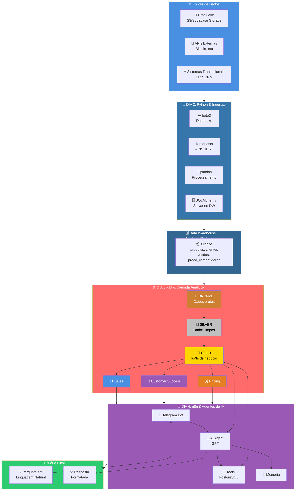

### 🔄 Fluxo de Dados End-to-End

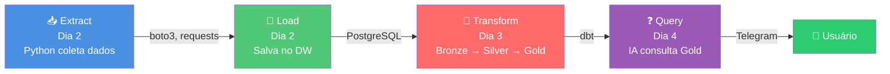

---

## 📚 As 4 Aulas da Imersão

### 📊 Dia 1: SQL & Analytics

**Objetivo:** Entender o negócio com SQL

**O que você aprende:**

- Fundamentos de SQL (SELECT, WHERE, JOIN, GROUP BY)
- Análise de vendas, produtos e clientes
- Comparação de preços com concorrentes
- Criação de segmentações e classificações
- 21 exemplos práticos do básico ao avançado

**Perguntas de Negócio Respondidas:**

- Quais são os produtos mais vendidos?
- Quem são os principais clientes?
- Estamos competitivos em preços?
- Quais categorias geram mais receita?

**Material:** [Aula 1 - SQL & Analytics](./aulas/aula-01-sql/)

---

### 🐍 Dia 2: Python & Ingestão de Dados

**Objetivo:** Coletar e integrar dados de fontes externas

**O que você aprende:**

- Conectar com Data Lakes (S3/Supabase Storage) usando boto3
- Ler arquivos Parquet de Data Lakes
- Salvar dados processados no PostgreSQL usando pandas
- Consumir APIs REST (ex: Bitcoin) usando requests
- Criar pipelines completos: DataLake → Banco, API → Banco
- Análises básicas com Pandas (head, info, describe, groupby, etc.)

**Perguntas de Negócio Respondidas:**

- Como coletar dados de sistemas externos?
- Como integrar dados de múltiplas fontes?
- Como automatizar a ingestão de dados?

**Material:** [Aula 2 - Python & Ingestão](./aulas/aula-02-python/)

---

### 🏗️ Dia 3: dbt & Camada Analítica

**Objetivo:** Transformar dados brutos em insights de negócio

**O que você aprende:**

- Arquitetura Medalhão (Bronze, Silver, Gold)
- ETL vs ELT (evolução histórica)
- Data Warehouse e modelagem analítica
- Criar camadas de dados profissionais com dbt
- Organizar KPIs em Data Marts (Sales, Customer Success, Pricing)
- Versionamento, testes e documentação de modelos

**Camadas Criadas:**

**🥉 Bronze (Raw):**
- `bronze_produtos`, `bronze_clientes`, `bronze_vendas`, `bronze_preco_competidores`
- Dados brutos, sem transformação

**🥈 Silver (Clean):**
- `silver_produtos`, `silver_clientes`, `silver_vendas`, `silver_preco_competidores`
- `silver_vendas_enriquecidas` (join de vendas + produtos + clientes)
- Dados limpos, padronizados e enriquecidos

**🥇 Gold (Business Metrics):**

**📊 Sales (Vendas):**
- `gold_kpi_produtos_top_receita` - Top produtos por receita
- `gold_kpi_produtos_top_quantidade` - Top produtos por quantidade
- `gold_kpi_receita_por_categoria` - Receita por categoria
- `gold_kpi_receita_por_canal` - Receita por canal (ecommerce/loja física)
- `gold_kpi_receita_por_marca` - Receita por marca
- `gold_kpi_vendas_temporais` - Vendas por período (dia, mês, hora)

**👥 Customer Success (Clientes):**
- `gold_kpi_clientes_top` - Top clientes por receita
- `gold_kpi_clientes_segmentacao` - Segmentação VIP/TOP_TIER/REGULAR

**💰 Pricing (Preços):**
- `gold_kpi_precos_competitividade` - Análise de competitividade vs concorrentes
- `gold_kpi_produtos_criticos_preco` - Produtos críticos por preço

**Perguntas de Negócio Respondidas:**

- Quais produtos geram mais receita?
- Quem são nossos clientes VIP?
- Estamos competitivos em preços?
- Qual canal de venda é mais eficiente?

**Material:** [Aula 3 - dbt & Camada Analítica](./aulas/aula-03-dbt/)

---

### 🤖 Dia 4: n8n & Agentes de IA

**Objetivo:** Criar interface conversacional para consultar dados

**O que você aprende:**

- Criar Agentes de IA usando n8n
- Conectar Telegram com banco de dados
- Configurar System Messages e Guardrails
- Implementar memória conversacional
- Usar Tools (PostgreSQL) para consultar dados
- Criar interface natural para consultar KPIs

**Progressão de Aprendizado:**

**🔥 Esquenta: Hello World**
- Agente básico que responde perguntas simples

**📋 Etapa 1: Agente de Turismo**
- Agente especializado com guardrails
- System Message e limites de comportamento

**📋 Etapa 2: Memória em Agentes**
- Memória conversacional
- Agente lembra informações anteriores

**📋 Etapa 3: Tool + Supabase**
- Agente consulta banco de dados via Tool
- Responde perguntas sobre KPIs em linguagem natural

**Exemplo de Uso:**
```
Usuário: "Quais são os top 5 produtos mais vendidos?"
Agente: [Consulta gold_kpi_produtos_top_quantidade]
        "🏆 Top 5 Produtos Mais Vendidos:
        1. Tênis Nike Air Max - 120 unidades
        2. Tênis Adidas Ultraboost - 95 unidades
        ..."

Usuário: "Quanto foi a receita total?"
Agente: [Consulta gold_kpi_receita_por_categoria]
        "💰 A receita total foi de R$ 125.000,00"
```

**Perguntas de Negócio Respondidas:**

- Como tornar dados acessíveis para não-técnicos?
- Como criar interface conversacional para consultar KPIs?
- Como usar IA para democratizar acesso a dados?

**Material:** [Aula 4 - n8n & Agentes de IA](./aulas/aula-04-n8n/)

---

## 🎯 KPIs e Métricas de Negócio

### 📊 Sales (Vendas)

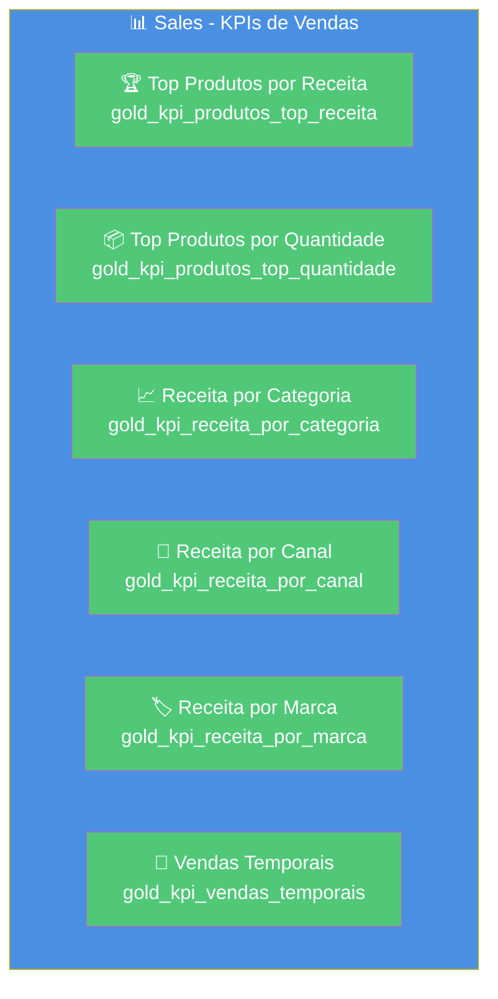

### 👥 Customer Success (Clientes)

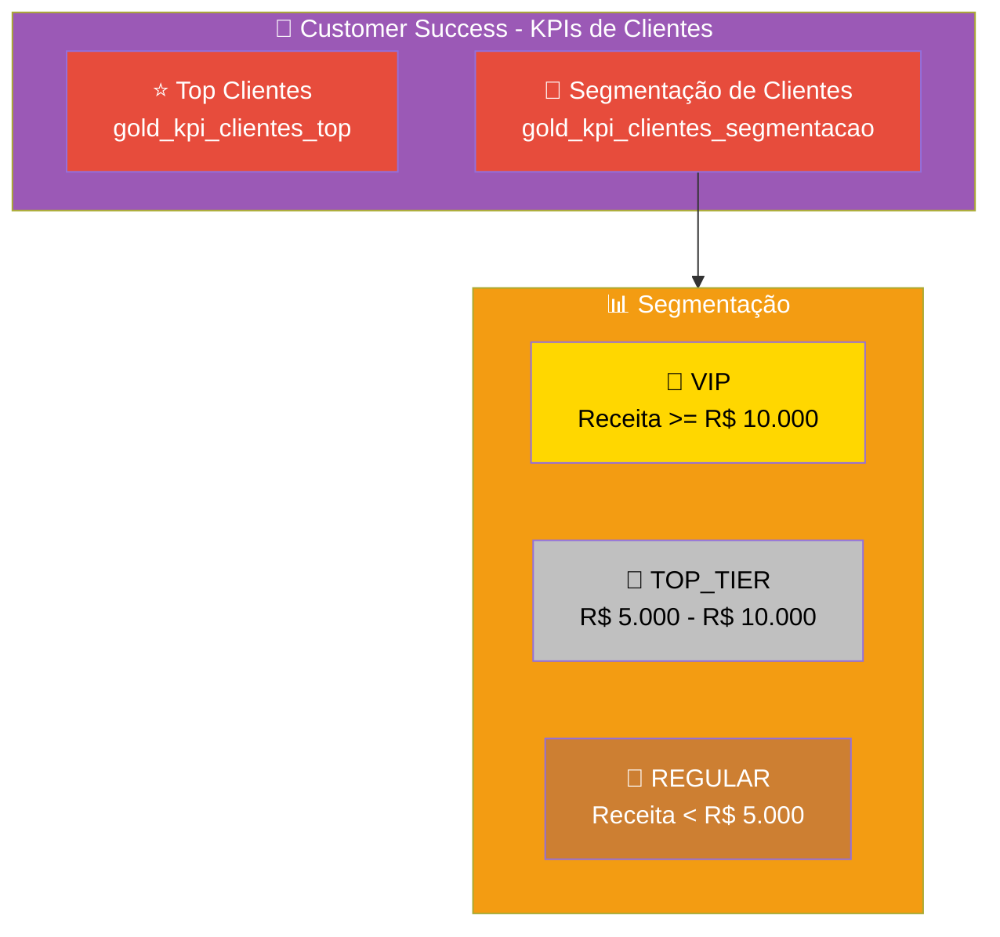

### 💰 Pricing (Preços)

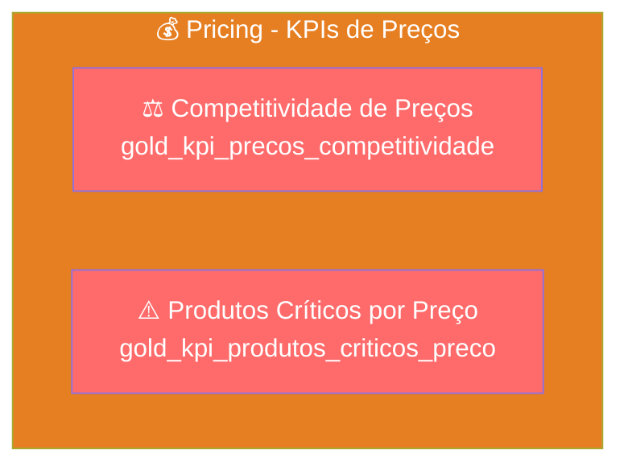

---

## 🛠️ Stack Tecnológico

### 📊 Camada de Dados

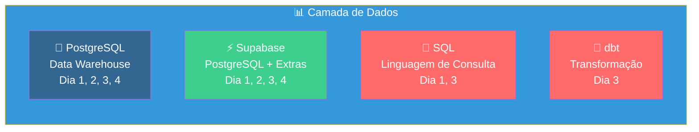

### 🐍 Camada de Ingestão

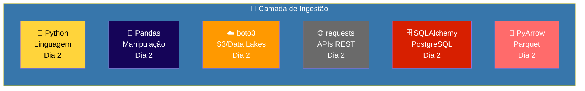

### 🤖 Camada de IA

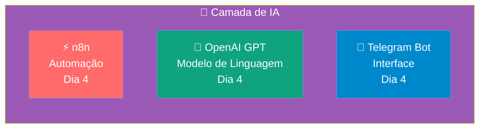

### ☁️ Infraestrutura

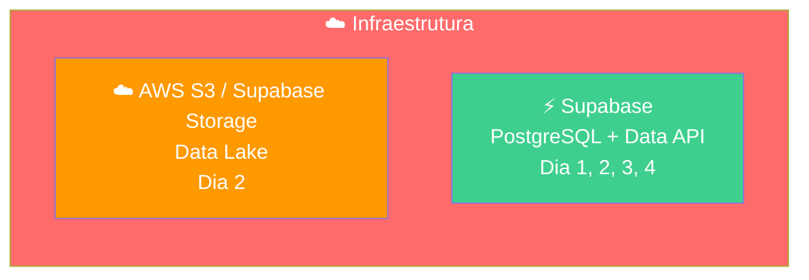

---

## 📊 Estrutura dos Datasets

Este projeto usa **4 datasets sintéticos** gerados com Faker para simular dados reais de e-commerce:

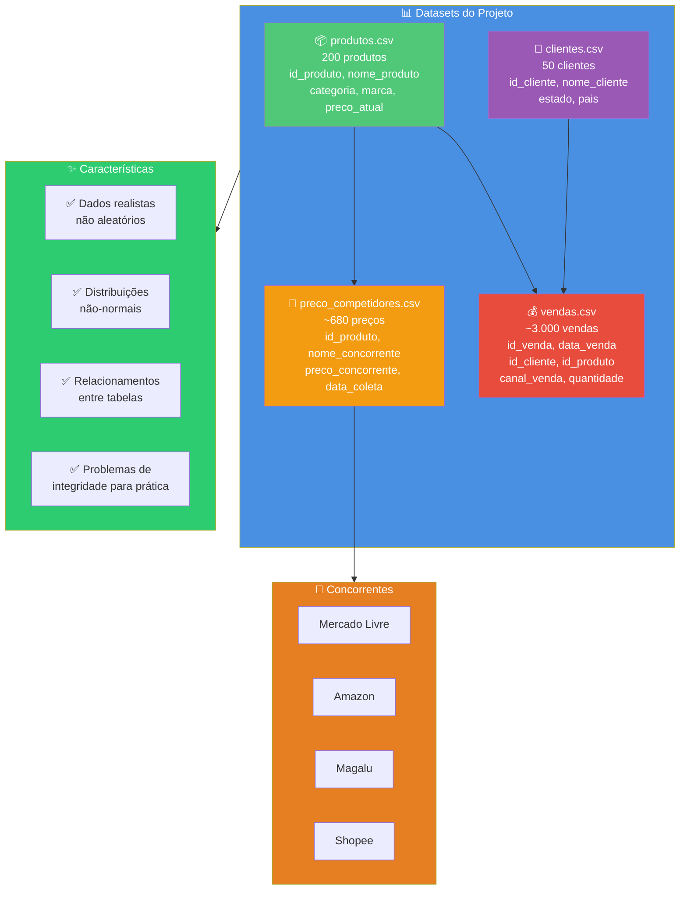

---

## 🚀 Como Começar

### Passo 1: Gerar os Datasets

```bash
# Instalar dependências
pip install faker

# Gerar os CSVs
python generate_datasets.py
```

Os arquivos serão criados na pasta `data/`:
- `produtos.csv`
- `clientes.csv`
- `vendas.csv`
- `preco_competidores.csv`

### Passo 2: Configurar Supabase

1. Crie uma conta no [Supabase](https://supabase.com/)
2. Crie um novo projeto
3. Importe os CSVs no Supabase SQL Editor:
   ```sql
   -- Criar tabelas e importar dados
   -- Veja instruções detalhadas em: aulas/aula-01-sql/README.md
   ```

### Passo 3: Começar a Aula 1

Siga as instruções completas em: **[Aula 1 - SQL & Analytics](./aulas/aula-01-sql/README.md)**

**Resumo rápido:**
1. Importe os CSVs em Supabase
2. Execute os 21 exemplos SQL em ordem
3. Pratique com os exercícios
4. Responda perguntas de negócio

### Passo 4: Continuar com as Aulas

- **Dia 2:** [Python & Ingestão de Dados](./aulas/aula-02-python/)
- **Dia 3:** [dbt & Camada Analítica](./aulas/aula-03-dbt/)
- **Dia 4:** [n8n & Agentes de IA](./aulas/aula-04-n8n/)

---

## 📁 Estrutura do Projeto

```
Projeto-Jornada-De-Dados/
├── data/                          # CSVs gerados
│   ├── produtos.csv
│   ├── clientes.csv
│   ├── vendas.csv
│   └── preco_competidores.csv
├── generate_datasets.py          # Gerador de dados sintéticos
├── aulas/
│   ├── aula-01-sql/              # Dia 1: SQL & Analytics
│   │   ├── exemplo-01-select-basico.sql
│   │   ├── exemplo-02-order-by.sql
│   │   ├── ... (21 exemplos SQL)
│   │   ├── README.md
│   │   └── KPIS.md
│   ├── aula-02-python/           # Dia 2: Python & Ingestão
│   │   ├── exemplos/
│   │   │   ├── exemplo-00-aquecimento-fundamentos.py
│   │   │   ├── exemplo-01-ler-datalake-parquet.py
│   │   │   ├── exemplo-02-salvar-banco-dados.py
│   │   │   ├── exemplo-03-projeto-completo.py
│   │   │   └── exemplo-04-ler-api-bitcoin.py
│   │   ├── README.md
│   │   └── requirements.txt
│   ├── aula-03-dbt/              # Dia 3: dbt & Camada Analítica
│   │   ├── models/
│   │   │   ├── bronze/           # Camada Bronze (raw)
│   │   │   ├── silver/           # Camada Silver (clean)
│   │   │   └── gold/             # Camada Gold (KPIs)
│   │   │       ├── sales/        # Data Mart: Vendas
│   │   │       ├── customer_success/  # Data Mart: Clientes
│   │   │       └── pricing/      # Data Mart: Preços
│   │   ├── dbt_project.yml
│   │   ├── profiles.yml
│   │   └── README.md
│   └── aula-04-n8n/              # Dia 4: n8n & Agentes de IA
│       ├── workflows/
│       │   ├── esquenta-hello-world.json
│       │   ├── etapa-01-agente-turismo.json
│       │   ├── etapa-02-memoria.json
│       │   └── etapa-03-tool-supabase.json
│       ├── README.md
│       └── GUIA_INSTALACAO.md
└── README.md                      # Este arquivo
```

---

## 🎯 Resultado Final da Imersão

Ao final dos 4 dias, você terá construído:

### ✅ Sistema Completo de Dados

1. **Data Warehouse** com dados estruturados
2. **Camada Analítica** profissional (Bronze → Silver → Gold)
3. **KPIs de Negócio** organizados em Data Marts
4. **Interface Conversacional** para consultar dados

### ✅ Habilidades Desenvolvidas

- ✅ **SQL avançado** - Consultas complexas e análises de negócio
- ✅ **Python para dados** - Ingestão, processamento e integração
- ✅ **dbt** - Engenharia de dados moderna e profissional
- ✅ **Agentes de IA** - Democratização de acesso a dados

### ✅ Projeto Real no GitHub

- ✅ Código versionado e documentado
- ✅ Arquitetura escalável e profissional
- ✅ Práticas de mercado aplicadas
- ✅ Portfolio pronto para apresentar

**Isso é o que o mercado procura.**

---

## 💡 Frase de Ouro

> **"Você não vai aprender ferramentas. Você vai aprender como dados resolvem problemas reais."**

Cada query, cada script, cada pipeline que você construir deve responder uma pergunta de negócio. Sempre pergunte: **"Por que isso importa?"**

---

## 📚 Material de Apoio

### 📊 Dia 1: SQL & Analytics
- **[Aula 1 - SQL & Analytics](./aulas/aula-01-sql/README.md)** - Guia completo do primeiro dia
- **[KPIs da Aula 1](./aulas/aula-01-sql/KPIS.md)** - Lista completa de KPIs e perguntas

### 🐍 Dia 2: Python & Ingestão
- **[Aula 2 - Python & Ingestão](./aulas/aula-02-python/README.md)** - Guia completo do segundo dia

### 🏗️ Dia 3: dbt & Camada Analítica
- **[Aula 3 - dbt & Camada Analítica](./aulas/aula-03-dbt/README.md)** - Guia completo do terceiro dia

### 🤖 Dia 4: n8n & Agentes de IA
- **[Aula 4 - n8n & Agentes de IA](./aulas/aula-04-n8n/README.md)** - Guia completo do quarto dia
- **[Guia de Instalação](./aulas/aula-04-n8n/GUIA_INSTALACAO.md)** - Setup completo do n8n

---

## 🎓 Para Quem é Este Projeto?

### ✅ Perfeito Para

- **Iniciantes em dados** que querem aprender do zero
- **Analistas de dados** que querem evoluir para engenharia
- **Desenvolvedores** que querem entrar na área de dados
- **Profissionais** que querem atualizar suas habilidades
- **Estudantes** que querem um projeto real para portfolio

### 🎯 Pré-requisitos

- **Nenhum conhecimento prévio necessário!**
- Apenas vontade de aprender e praticar
- Acesso a internet para usar Supabase e n8n Cloud

---

## 🚀 Próximos Passos

### Para Começar a Imersão:

1. **Gere os datasets:** Execute `python generate_datasets.py`
2. **Configure Supabase:** Crie conta e projeto
3. **Comece o Dia 1:** Siga as instruções em [Aula 1 - SQL & Analytics](./aulas/aula-01-sql/README.md)
4. **Execute os exemplos:** 21 exemplos SQL em ordem progressiva
5. **Avance para Dia 2:** Python & Ingestão de Dados
6. **Continue até Dia 4:** Construa o sistema completo

---

## 📊 Métricas do Projeto

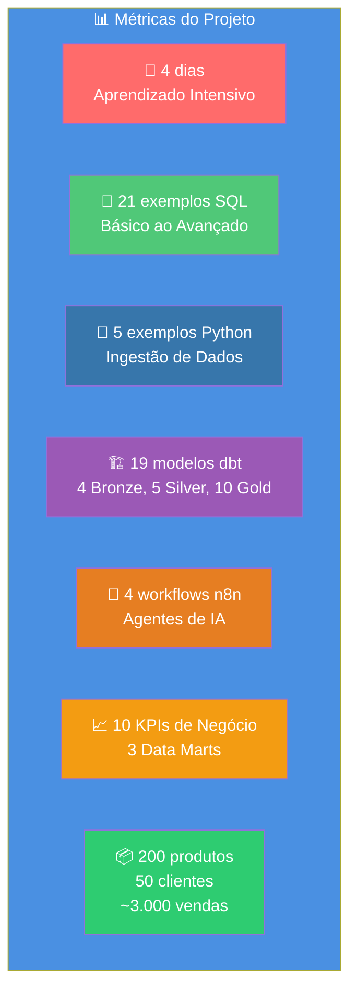

---

## 🎯 Objetivos de Aprendizado

Ao final da imersão, você será capaz de:

- ✅ **Analisar dados** com SQL avançado
- ✅ **Coletar dados** de múltiplas fontes (APIs, Data Lakes)
- ✅ **Transformar dados** em camadas analíticas profissionais
- ✅ **Criar KPIs** de negócio organizados
- ✅ **Democratizar dados** com Agentes de IA
- ✅ **Construir sistemas** de dados end-to-end

---

**Boa jornada! 🚀**

*Este projeto foi criado para ser prático, real e aplicável. Cada linha de código, cada query, cada modelo foi pensado para resolver um problema real de negócio.*
