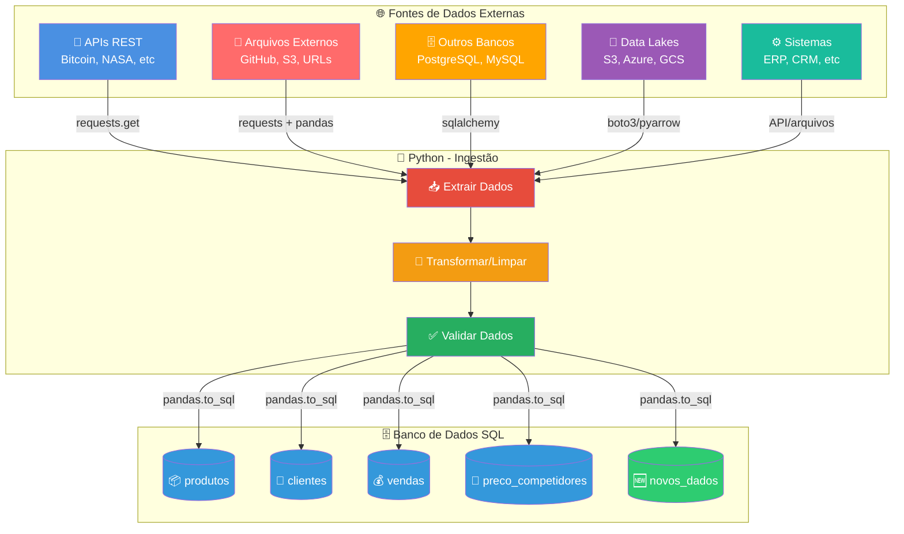

# 🐍 Dia 2: Python & Ingestão de Dados | Jornada de Dados

Bem-vindo ao **segundo dia da imersão Jornada de Dados**! Hoje você vai aprender Python para trabalhar com dados, focando em **ingestão** - o processo de coletar dados de diferentes fontes e prepará-los para análise.

---

## 📖 O que é Python para Dados?

**Python** é uma linguagem de programação versátil e poderosa que se tornou o padrão da indústria para trabalhar com dados. É a ferramenta que permite:

- ✅ **Ingerir dados** - Coletar dados de APIs, arquivos externos, bancos de dados, Data Lakes
- ✅ **Processar dados** - Limpar, transformar e preparar dados para análise
- ✅ **Analisar dados** - Fazer análises estatísticas e exploratórias
- ✅ **Automatizar tarefas** - Criar scripts que fazem o trabalho pesado

**Python não é apenas uma linguagem de programação.** É um ecossistema completo com bibliotecas especializadas para cada necessidade de dados.

---

## 🔄 Processo de Ingestão de Dados

**Ontem (Dia 1 - SQL):** Trabalhamos com dados que **já existiam** no banco de dados (4 tabelas: produtos, clientes, vendas, preco_competidores).

**Hoje (Dia 2 - Python):** Vamos **trazer novos dados** para o banco através do Python, coletando dados de diferentes fontes externas.

### 📊 Fluxo de Ingestão de Dados

O diagrama abaixo mostra como Python atua como **ponte** entre diferentes fontes de dados e o banco SQL:



### 🎯 Exemplo Prático: Integração de Dados Externos

**Caso de Negócio:** Coletar dados de produtos e preços de arquivos públicos (GitHub, S3) para análise competitiva.

**Fluxo:**
1. 📁 **Arquivos Externos** → Python baixa dados de repositórios públicos (Parquet, CSV)
2. 🔄 **Transformação** → Limpa e padroniza dados
3. ✅ **Validação** → Verifica qualidade dos dados
4. 🗄️ **Carga** → Salva na tabela `preco_competidores` do banco SQL
5. 📊 **Análise** → SQL compara nossos preços com concorrentes

**Resultado:** Dados atualizados de concorrentes prontos para análise no banco SQL!

### 📚 Principais Bibliotecas Python para Dados

| Biblioteca | Logo | Descrição | GitHub |
|------------|------|-----------|--------|
| **Pandas** | 🐼 | Manipulação e análise de dados tabulares | [pandas-dev/pandas](https://github.com/pandas-dev/pandas) |
| **PySpark** | ⚡ | Processamento distribuído de Big Data | [apache/spark](https://github.com/apache/spark) |
| **Airflow** | ✈️ | Orquestração e agendamento de pipelines | [apache/airflow](https://github.com/apache/airflow) |
| **Streamlit** | 🎈 | Criação rápida de dashboards e apps web | [streamlit/streamlit](https://github.com/streamlit/streamlit) |
| **NumPy** | 🔢 | Computação numérica e arrays multidimensionais | [numpy/numpy](https://github.com/numpy/numpy) |
| **Scikit-learn** | 🤖 | Machine Learning e análise de dados | [scikit-learn/scikit-learn](https://github.com/scikit-learn/scikit-learn) |
| **Matplotlib** | 📊 | Visualização de dados e gráficos | [matplotlib/matplotlib](https://github.com/matplotlib/matplotlib) |
| **Requests** | 🌐 | Requisições HTTP e consumo de APIs | [psf/requests](https://github.com/psf/requests) |
| **PyArrow** | 🏹 | Leitura/escrita de Parquet e formatos colunares | [apache/arrow](https://github.com/apache/arrow) |
| **SQLAlchemy** | 🗄️ | ORM e acesso a bancos de dados | [sqlalchemy/sqlalchemy](https://github.com/sqlalchemy/sqlalchemy) |

**Cada biblioteca resolve um problema específico:**
- 🐼 **Pandas**: Trabalhar com dados tabulares (CSV, Excel, SQL)
- ⚡ **PySpark**: Processar grandes volumes de dados distribuídos
- ✈️ **Airflow**: Orquestrar e agendar pipelines de dados
- 🎈 **Streamlit**: Criar dashboards interativos rapidamente
- 🔢 **NumPy**: Operações matemáticas e arrays eficientes
- 🤖 **Scikit-learn**: Machine Learning e modelos preditivos
- 📊 **Matplotlib**: Visualizar dados com gráficos
- 🌐 **Requests**: Consumir APIs e fazer requisições HTTP
- 🏹 **PyArrow**: Trabalhar com arquivos Parquet (formato otimizado para Big Data)
- 🗄️ **SQLAlchemy**: Conectar e trabalhar com bancos de dados

**Exemplo:**
```python
# Você diz: "Quero ler dados de vendas e calcular receita total"
import pandas as pd

df = pd.read_csv("vendas.csv")
df['receita'] = df['quantidade'] * df['preco_unitario']
receita_total = df['receita'].sum()

print(f"Receita total: R$ {receita_total:,.2f}")
```

---

## 💼 Mercado de Python para Dados

Python é a linguagem mais usada no mercado de dados e ciência de dados:

### 📊 Por que Python é importante?

1. **Ecossistema rico**: Pandas, NumPy, Scikit-learn, TensorFlow, PyTorch
2. **Demanda de mercado**: Habilidade essencial em 90% das vagas de dados
3. **Versatilidade**: Serve para análise, engenharia, machine learning, automação
4. **Comunidade**: Grande comunidade, muitos recursos e bibliotecas open-source
5. **Integração**: Fácil integração com bancos de dados, APIs, sistemas

### 🎯 Onde Python é usado?

- **Data Engineering**: Pipelines de dados, ETL, ingestão
- **Data Analysis**: Análise exploratória, relatórios automatizados
- **Data Science**: Machine Learning, estatística, modelagem
- **Automação**: Scripts para tarefas repetitivas
- **APIs e Integrações**: Conectar diferentes sistemas

### 💰 Salários no Brasil (2024)

- **Analista de Dados Júnior**: R$ 3.000 - R$ 6.000
- **Analista de Dados Pleno**: R$ 6.000 - R$ 10.000
- **Analista de Dados Sênior**: R$ 10.000 - R$ 18.000
- **Cientista de Dados**: R$ 8.000 - R$ 20.000+
- **Engenheiro de Dados**: R$ 10.000 - R$ 25.000+

**Python é a base de todas essas carreiras.**

**Pesquisa de Vagas:**
- 🔍 [LinkedIn: Python & SQL no Brasil](https://www.linkedin.com/jobs/search/?currentJobId=4350781561&geoId=106057199&keywords=python%20%26%20sql&origin=JOB_SEARCH_PAGE_SEARCH_BUTTON&refresh=true) - **13.000+ vagas disponíveis**

**Fonte:** Glassdoor, LinkedIn, pesquisas de mercado 2024

---

## 🎯 Foco do Curso

Neste **Dia 2**, vamos focar em:

✅ **Ingestão de Dados** - 70% do tempo  
✅ **Tratamento Básico** - 20% do tempo  
✅ **Exportação** - 10% do tempo  

**Por quê?** Engenheiros e analistas de dados passam a maior parte do tempo coletando e preparando dados. Você vai aprender a **pensar como engenheiro de dados** e **integrar diferentes fontes de dados**.

---

## 🔄 SQL vs Python: Qual a Diferença?

### 📊 SQL (Dia 1)
**Trabalha com dados que JÁ EXISTEM no banco de dados**

- ✅ Dados já estão armazenados
- ✅ Foco em consultar e analisar
- ✅ Linguagem declarativa (diz o que quer)
- ✅ Otimizado para grandes volumes
- ✅ Ideal para análises e relatórios

**Exemplo:**
```sql
-- Os dados JÁ ESTÃO no banco
SELECT * FROM vendas WHERE data_venda > '2024-01-01';
```

### 🐍 Python (Dia 2)
**BUSCA dados de sistemas externos e integra diferentes fontes**

- ✅ Dados vêm de sistemas externos (APIs, arquivos externos, Data Lakes)
- ✅ Foco em coletar e integrar
- ✅ Linguagem imperativa (diz como fazer)
- ✅ Ideal para automação e integração
- ✅ Conecta diferentes sistemas

**Exemplo:**
```python
# BUSCA dados de uma API externa
import requests
dados = requests.get("https://api.coinbase.com/v2/prices/spot").json()
```

### 🎯 Resumo

| Aspecto | SQL | Python |
|---------|-----|--------|
| **Dados** | Já existem no banco | Busca de sistemas externos |
| **Foco** | Consultar e analisar | Coletar e integrar |
| **Uso** | Análises e relatórios | APIs, scraping, automação |
| **Quando usar** | Dados já armazenados | Dados externos, integração |

**Python na engenharia de dados = COMUNICAR e INTEGRAR sistemas externos!**

---

## 🎯 Perguntas de Negócio que Vamos Responder

Este **Dia 2** foi criado para resolver problemas reais de ingestão de dados. Abaixo estão todas as perguntas que vamos responder com os exemplos:

### 🔥 Aquecimento (Fundamentos)

1. **Por que preciso saber Python básico para trabalhar com dados?** *(Exemplo 00)*
2. **O que é uma API e como processar dados JSON?** *(Exemplo 00b)*
3. **Por que usar Pandas ao invés de listas/dicionários?** *(Exemplo 00c)*

### 📂 Ingestão de Dados (Exemplos 1-7)

4. **Como carregar dados de CSVs em Python?** *(Exemplo 1)*
5. **Como combinar dados de múltiplos arquivos?** *(Exemplo 2)*
6. **Como buscar dados de uma API REST?** *(Exemplo 3)*
7. **Como ler arquivos de fontes externas (GitHub, S3, Data Lakes)?** *(Exemplo 4)*
8. **Como ler dados diretamente de um banco de dados?** *(Exemplo 5)*
9. **Como limpar e tratar dados inconsistentes?** *(Exemplo 6)*
10. **Como exportar dados processados para diferentes formatos?** *(Exemplo 7)*

---

## 🔥 Bloco 1: Aquecimento Python (20min)

Antes de trabalhar com dados, é essencial dominar os fundamentos de Python. Este bloco garante que você tenha a base necessária.

#### `exemplo-00-aquecimento-fundamentos.py`
**Conceito:** Fundamentos de Python  
**Pergunta de Negócio:** Por que preciso saber Python básico para trabalhar com dados?  
**O que você aprende:**
- Print e Hello World
- Variáveis e tipos básicos (str, int, float)
- Estruturas de dados (lista, dicionário)
- Métodos úteis
- Por que isso é importante para trabalhar com dados

**Conceitos Python:**
- `print()`: exibir informações
- Variáveis: `str`, `int`, `float`
- Listas: `[]` - coleção ordenada
- Dicionários: `{}` - pares chave-valor
- Métodos: funções dos objetos (`.upper()`, `.strip()`, etc.)

**Por que é importante?**
- APIs retornam dados em JSON (que são dicionários em Python)
- Arquivos externos precisam ser baixados e processados
- Dados de CSVs são lidos como strings e precisam conversão
- Pandas usa esses conceitos por baixo dos panos

---

#### `exemplo-00c-introducao-pandas.py`
**Conceito:** Introdução ao Pandas  
**Pergunta de Negócio:** Por que Pandas é a biblioteca mais usada para dados em Python?  
**O que você aprende:**
- O que é Pandas
- Por que usar Pandas ao invés de listas/dicionários
- Conceitos básicos: Series e DataFrame
- Operações básicas com Pandas
- Por que Pandas é essencial para trabalhar com dados

**Conceitos Python:**
- `pd.Series`: uma coluna de dados
- `pd.DataFrame`: tabela de dados
- Operações: filtros, agregações, cálculos
- `df.groupby()`: agrupar dados
- `df.describe()`: estatísticas descritivas

**Vantagens do Pandas:**
- Operações diretas (sem loops)
- Código limpo e legível
- Otimizado para performance
- Funcionalidades prontas (filtros, agregações, joins)
- Integração com Excel, SQL, APIs

---

## 🎯 Progressão de Aprendizado

A aula está dividida em **4 blocos de 20 minutos cada**, totalizando 80 minutos de aprendizado prático:

1. **🔥 Aquecimento Python (20min)** - Fundamentos essenciais
2. **💾 Conectar com DataLake (20min)** - Trabalhar com armazenamento em nuvem
3. **🗄️ Salvar no Banco de Dados (20min)** - Persistir dados processados
4. **🌐 Conectar com uma API (20min)** - Integrar dados externos

---

### 🔥 Bloco 1: Aquecimento Python (20min)

Antes de trabalhar com dados, é essencial dominar os fundamentos de Python. Este bloco garante que você tenha a base necessária.

---

### 💾 Bloco 2: Conectar com DataLake (20min)

Data Lakes são repositórios centralizados para armazenar grandes volumes de dados. Aprenda a conectar e ler dados de Data Lakes usando a API S3 (padrão da indústria).

#### `exemplo-00b-api-json.py`
**Conceito:** Fundamentos de APIs e JSON  
**Pergunta de Negócio:** O que é uma API e como processar dados JSON em Python?  
**O que você aprende:**
- O que é uma API (Application Programming Interface)
- O que é JSON e como funciona
- Como JSON se relaciona com dicionários Python
- Como processar dados de APIs
- Por que isso é essencial para ingestão de dados

**Conceitos Python:**
- `json.loads()`: converte JSON string para dicionário Python
- `json.dumps()`: converte dicionário Python para JSON string
- Acessar dados aninhados: `dados["chave"]["subchave"]`
- Processar listas de dicionários

**Por que APIs são importantes?**
- Python na engenharia de dados = COMUNICAR com sistemas externos
- SQL trabalha com dados que JÁ EXISTEM no banco
- Python BUSCA dados de sistemas externos via APIs
- Permite integrar dados de múltiplas fontes

**Casos de uso:**
- Consumir APIs REST
- Processar respostas de APIs
- Converter entre formatos
- Trabalhar com dados estruturados

**Resultado Esperado:**
- Compreensão do que é API e JSON
- Capacidade de processar dados JSON em Python
- Entendimento de como APIs funcionam

---

#### `exemplo-03-ler-api-rest.py`
**Conceito:** Consumir APIs REST na prática  
**Pergunta de Negócio:** Como obter dados de uma API externa em Python?  
**O que você aprende:**
- Como fazer requisições HTTP com requests
- Como consumir APIs REST
- Como tratar respostas JSON
- Como trabalhar com diferentes tipos de dados (JSON, imagens)
- Exemplos práticos: Bitcoin e NASA

**Conceitos Python:**
- `requests.get()`: faz requisição HTTP GET
- `response.json()`: converte resposta para dicionário Python
- `response.raise_for_status()`: verifica erros HTTP
- Tratamento de exceções com try/except

**Exemplos práticos:**
- **API Bitcoin (Coinbase)**: preços de criptomoedas em tempo real
- **API NASA**: imagens e dados espaciais

**Resultado Esperado:**
- Dados obtidos de API Bitcoin com sucesso
- Dados obtidos de API NASA com sucesso
- Respostas JSON convertidas para DataFrame
- Tratamento de erros implementado

---

#### `exemplo-04-ler-arquivos-externos.py`
**Conceito:** Conectar com DataLake (S3/Supabase Storage)  
**Pergunta de Negócio:** Como ler dados de um Data Lake usando a API S3?  
**O que você aprende:**
- O que é um Data Lake e por que é importante
- Como usar boto3 para conectar com S3/Supabase Storage
- Como ler arquivos CSV e Parquet de Data Lakes
- Por que AWS S3 é o padrão da indústria (mais de 50% das empresas usam)
- Como trabalhar com armazenamento em nuvem

**Conceitos Python:**
- `boto3.client()`: cria cliente S3 (compatível com Supabase Storage)
- `s3.get_object()`: baixa arquivo do Data Lake
- `pd.read_csv(io.BytesIO())`: lê CSV da memória
- `pd.read_parquet(io.BytesIO())`: lê Parquet da memória

**Por que Data Lakes são importantes?**
- Armazenam grandes volumes de dados (terabytes/petabytes)
- Mantêm dados em formato original (sem transformação prévia)
- Suportam múltiplos formatos (CSV, Parquet, JSON)
- Escalabilidade horizontal (cresce conforme necessidade)
- Economia de custos (armazenamento barato)

**AWS S3 é o padrão da indústria:**
- Mais de 50% das empresas usam AWS S3 para Data Lakes
- API padrão que funciona com múltiplas ferramentas
- Compatível com Supabase Storage, MinIO, e outros

**Resultado Esperado:**
- Conexão estabelecida com Data Lake
- Arquivo CSV baixado e carregado com sucesso
- Dados analisados (concorrentes, estatísticas de preços)
- Compreensão da importância de Data Lakes na indústria

---

### 🗄️ Bloco 3: Salvar no Banco de Dados (20min)

Após processar dados, é essencial salvá-los em um banco de dados para consultas e análises. Aprenda a conectar Python com bancos SQL e persistir dados processados.

#### `exemplo-05-ler-banco-dados.py`
**Conceito:** Conectar Python com bancos de dados SQL  
**Pergunta de Negócio:** Como ler dados diretamente de um banco SQL em Python?  
**O que você aprende:**
- Como conectar Python com SQLite
- Como conectar Python com PostgreSQL
- Como executar queries SQL e trazer para pandas
- Como trabalhar com diferentes tipos de banco

**Conceitos Python:**
- `sqlite3.connect()`: conecta com SQLite
- `pd.read_sql_query()`: executa SQL e retorna DataFrame
- `sqlalchemy.create_engine()`: cria engine para PostgreSQL
- `df.to_sql()`: salva DataFrame em tabela SQL

**Vantagens:**
- Dados sempre atualizados (não precisa exportar CSV)
- Queries complexas diretamente no banco
- Performance melhor para grandes volumes
- Integração nativa com SQL

**Resultado Esperado:**
- Conexão com banco estabelecida
- Queries SQL executadas com sucesso
- Dados retornados como DataFrame

---

#### `exemplo-07-exportar-dados.py`
**Conceito:** Salvar dados processados no banco de dados  
**Pergunta de Negócio:** Como salvar dados processados em um banco SQL?  
**O que você aprende:**
- Como exportar DataFrame para banco de dados SQL
- Como usar `df.to_sql()` para persistir dados
- Como escolher o formato adequado (CSV, JSON, Excel, SQL)
- Como trabalhar com diferentes tipos de banco

**Conceitos Python:**
- `df.to_sql()`: exporta DataFrame para tabela SQL
- `df.to_csv()`: exporta para CSV
- `df.to_json()`: exporta para JSON
- `df.to_excel()`: exporta para Excel
- `df.to_parquet()`: exporta para Parquet (otimizado)

**Quando usar cada formato:**
- **SQL**: Dados que precisam ser consultados frequentemente
- **CSV**: Universal, fácil de abrir em Excel
- **JSON**: Ideal para APIs e integrações
- **Excel**: Bom para relatórios e apresentações
- **Parquet**: Otimizado para big data, compressão eficiente

**Resultado Esperado:**
- Dados exportados para banco de dados com sucesso
- Dados prontos para consultas SQL
- Formato escolhido baseado no uso

---

### 🌐 Bloco 4: Conectar com uma API (20min)

APIs são a forma padrão de comunicação entre sistemas. Aprenda a consumir APIs REST e processar dados JSON em Python.

---

## 📚 Exemplos Adicionais (Opcionais)

Estes exemplos complementam o aprendizado e podem ser explorados após os 4 blocos principais:

### `exemplo-01-ler-csv.py` e `exemplo-02-ler-multiplos-csv.py`
**Conceito:** Trabalhar com arquivos CSV locais  
**Quando usar:** Quando você tem arquivos CSV no seu computador e precisa carregá-los.

### `exemplo-06-tratar-dados.py`
**Conceito:** Limpar e preparar dados para análise  
**Quando usar:** Quando precisa tratar dados inconsistentes, faltantes ou duplicados antes de salvar no banco.

---

## 🎓 Como Usar

### 1. Instalar Dependências

```bash
# Criar ambiente virtual (recomendado)
python -m venv venv

# Ativar ambiente virtual
# No Windows:
venv\Scripts\activate
# No Mac/Linux:
source venv/bin/activate

# Instalar dependências
pip install -r requirements.txt
```

### 2. Executar Exemplos

```bash
# Navegar para diretório de exemplos
cd aulas/aula-02-python/exemplos

# 🔥 BLOCO 1: Aquecimento Python (20min)
python exemplo-00-aquecimento-fundamentos.py
python exemplo-00c-introducao-pandas.py

# 💾 BLOCO 2: Conectar com DataLake (20min)
python exemplo-04-ler-arquivos-externos.py

# 🗄️ BLOCO 3: Salvar no Banco de Dados (20min)
python exemplo-05-ler-banco-dados.py
python exemplo-07-exportar-dados.py

# 🌐 BLOCO 4: Conectar com uma API (20min)
python exemplo-00b-api-json.py
python exemplo-03-ler-api-rest.py
```

### 3. Modificar e Experimentar

- Altere os caminhos dos arquivos
- Teste com seus próprios dados
- Combine conceitos de diferentes exemplos
- Crie seus próprios scripts

---

## 📝 Checklist de Aprendizado

Após fazer todos os exemplos, você deve ser capaz de:

### 🔥 Bloco 1: Aquecimento Python
- [ ] Usar print e f-strings
- [ ] Trabalhar com variáveis (str, int, float)
- [ ] Usar listas e dicionários
- [ ] Entender o que é Pandas e por que usar
- [ ] Criar Series e DataFrames
- [ ] Fazer operações básicas com Pandas

### 💾 Bloco 2: Conectar com DataLake
- [ ] Entender o que é um Data Lake
- [ ] Usar boto3 para conectar com S3/Supabase Storage
- [ ] Baixar arquivos de Data Lakes
- [ ] Ler arquivos CSV e Parquet de Data Lakes
- [ ] Compreender a importância de Data Lakes na indústria

### 🗄️ Bloco 3: Salvar no Banco de Dados
- [ ] Conectar Python com SQLite e PostgreSQL
- [ ] Executar queries SQL e trazer para pandas
- [ ] Salvar DataFrames em tabelas SQL
- [ ] Exportar dados para diferentes formatos (CSV, JSON, Excel, Parquet)

### 🌐 Bloco 4: Conectar com uma API
- [ ] Entender o que é API e JSON
- [ ] Converter entre JSON e dicionários Python
- [ ] Fazer requisições HTTP para APIs
- [ ] Processar respostas de APIs
- [ ] Integrar dados de múltiplas APIs

---

## 💡 Dicas

- **Execute em ordem:** Cada exemplo introduz um conceito novo
- **Modifique:** Tente adaptar os scripts para seus próprios dados
- **Combine:** Use conceitos de exemplos anteriores em novos contextos
- **Valide:** Sempre verifique se os dados foram carregados corretamente
- **Pratique:** Crie seus próprios scripts de ingestão

---

## 🐛 Troubleshooting

### Erro: "ModuleNotFoundError: No module named 'pandas'"
```bash
pip install pandas
```

### Erro: "FileNotFoundError: vendas.csv"
- Verifique se os arquivos CSV estão na pasta `data/`
- Verifique o caminho relativo no script

### Erro: "ConnectionError" ao baixar arquivos externos
- Verifique sua conexão com internet
- Verifique se a URL do arquivo está correta e acessível
- Alguns repositórios podem ter rate limiting - adicione delays entre requisições

### Erro: "sqlite3.OperationalError: no such table"
- Execute primeiro o exemplo que cria o banco
- Verifique se o banco foi criado corretamente

---

## 🎯 Próximos Passos

Depois de dominar todos os exemplos:

1. Pratique criando seus próprios scripts de ingestão
2. Combine diferentes fontes de dados
3. Automatize processos de coleta de dados
4. Avance para a **Aula 3: Engenharia de Dados**

---

## 📊 Resumo dos Conceitos por Exemplo

| Bloco | Exemplo | Conceito Principal | Tempo |
|-------|---------|-------------------|-------|
| 🔥 1 | 00 | Fundamentos Python | 10min |
| 🔥 1 | 00c | Introdução Pandas | 10min |
| 💾 2 | 04 | DataLake (S3/Supabase) | 20min |
| 🗄️ 3 | 05 | Banco de Dados | 10min |
| 🗄️ 3 | 07 | Exportar Dados | 10min |
| 🌐 4 | 00b | APIs e JSON | 10min |
| 🌐 4 | 03 | API REST | 10min |

**Total: 4 blocos de 20 minutos cada = 80 minutos de aprendizado prático!** 🚀

---

## 🔗 Recursos Adicionais

- [Documentação Pandas](https://pandas.pydata.org/docs/)
- [Documentação Requests](https://requests.readthedocs.io/)
- [Documentação PyArrow (Parquet)](https://arrow.apache.org/docs/python/)
- [SQLAlchemy Tutorial](https://docs.sqlalchemy.org/en/20/tutorial/)

---

**Boa jornada! 🐍**

