# 🏗️ Dia 3: dbt & Camada Analítica | Jornada de Dados

Bem-vindo ao **terceiro dia da imersão Jornada de Dados**! Hoje você vai aprender a criar uma **camada analítica profissional** usando **dbt** (data build tool), seguindo as melhores práticas da indústria.

---

## 📜 A Evolução: ETL Clássico → ELT Moderno

**30 anos de evolução em arquitetura de dados resumidos em uma mudança fundamental.**

Este diagrama resume décadas de evolução. Entender essa mudança clareia muito e vai te ajudar bastante na sua jornada com dados.


### 🕰️ Anos 90-2000: ETL Clássico

**A lógica era simples: Primeiro modela. Depois carrega.**

```
Fonte → [Transformação FORA do DW] → Data Warehouse
```

**Características:**
- ✅ Transformações aconteciam **fora** do Data Warehouse
- ✅ Ferramentas pesadas (SSIS, Informatica, Talend)
- ✅ Alto custo de infraestrutura
- ✅ Pouca flexibilidade
- ✅ Só dados "bons" entravam no DW
- ✅ Qualquer mudança quebrava o pipeline
- ✅ Jobs complexos e SQL espalhado em procedures
- ✅ Orquestração complicada (10 jeitos diferentes)

**Problemas:**
- 🔴 **Rígido**: Mudanças quebravam tudo
- 🔴 **Caro**: Infraestrutura extra necessária
- 🔴 **Retrabalho**: Reprocessar era difícil
- 🔴 **Complexo**: Múltiplas ferramentas e processos

**Exemplo Real:**
```python
# Python/Spark transforma ANTES de carregar
df = pd.read_csv("vendas.csv")
df = df.groupby("produto").sum()  # Transformação FORA do DW
df.to_sql("vendas_agregadas", engine)  # Só dados "bons" entram
```

**Funcionava, mas era rígido, caro e gerava muito retrabalho.**

### 🚀 2010-2020: A Virada para ELT Moderno

**A lógica mudou: Carrega tudo. Modela depois.**

```
Fonte → Data Warehouse → [Transformação DENTRO do DW]
```

**Mudanças que permitiram ELT:**
- ✅ **Custo de storage caiu drasticamente** (armazenar dados brutos ficou barato)
- ✅ **Power dos Data Warehouses aumentou** (Snowflake, BigQuery, Redshift)
- ✅ **SQL se tornou padrão** (todos sabem SQL)
- ✅ **Cloud facilitou escalabilidade**

**Características:**
- ✅ Dados brutos entram no DW/Lakehouse primeiro
- ✅ Processamento acontece **dentro** do warehouse
- ✅ Flexibilidade para reprocessar quando necessário
- ✅ Dados brutos sempre disponíveis
- ✅ Transformação usando SQL (linguagem do DW)

**Vantagens:**
- 🟢 **Flexível**: Dados brutos sempre disponíveis
- 🟢 **Barato**: Usa recursos do DW (sem infra extra)
- 🟢 **Simples**: SQL é a linguagem do DW
- 🟢 **Escalável**: DW escala automaticamente

**Exemplo Real:**
```sql
-- Dados brutos carregados primeiro
-- Python apenas faz: df.to_sql("vendas_raw", engine)

-- Transformação DENTRO do DW usando SQL
SELECT
    produto,
    SUM(receita) AS receita_total
FROM vendas_raw
GROUP BY produto
```

### 🎯 A Diferença Fundamental

| Aspecto | ETL Clássico | ELT Moderno |
|---------|--------------|-------------|
| **Filosofia** | O modelo decide o que entra | O dado entra inteiro, o modelo nasce depois |
| **Transformação** | Fora do DW | Dentro do DW |
| **Flexibilidade** | Baixa (reprocessar é difícil) | Alta (dados brutos sempre disponíveis) |
| **Custo** | Alto (infra extra) | Baixo (usa recursos do DW) |
| **Complexidade** | Alta (múltiplas ferramentas) | Baixa (SQL no DW) |
| **Manutenção** | Complexa | Simples |

**A diferença no fundo é essa:**
- **ETL**: O modelo decide o que entra
- **ELT**: O dado entra inteiro, o modelo nasce depois

### 🏆 dbt Labs: A Ferramenta que Organizou o SQL

**dbt Labs foi fundamental nessa virada.**

Antes do dbt, transformação em SQL era:
- ❌ SQL espalhado em procedures
- ❌ Sem versionamento
- ❌ Sem testes
- ❌ Dependências manuais
- ❌ Sem padrões

**dbt organizou o SQL. Transformação virou:**
- ✅ **Código versionado** (Git)
- ✅ **Testes** integrados
- ✅ **Dependências claras** (resolvidas automaticamente)
- ✅ **Padrões de modelagem** (bronze, silver, gold)
- ✅ **Documentação** automática
- ✅ **Tudo isso sem infraestrutura extra**

**dbt não resolve tudo, mas resolveu o "T" (Transform) muito bem.**

---

## 📖 O que é dbt?

**30 anos de evolução em arquitetura de dados resumidos em uma mudança fundamental:**

### 🕰️ Anos 90-2000: ETL Clássico

**A lógica era simples: Primeiro modela. Depois carrega.**

```
Fonte → [Transformação FORA do DW] → Data Warehouse
```

**Características:**
- ✅ Transformações aconteciam **fora** do Data Warehouse
- ✅ Ferramentas pesadas (SSIS, Informatica, Talend)
- ✅ Alto custo de infraestrutura
- ✅ Pouca flexibilidade
- ✅ Só dados "bons" entravam no DW
- ✅ Qualquer mudança quebrava o pipeline
- ✅ Jobs complexos e SQL espalhado em procedures
- ✅ Orquestração complicada

**Problemas:**
- 🔴 **Rígido**: Mudanças quebravam tudo
- 🔴 **Caro**: Infraestrutura extra necessária
- 🔴 **Retrabalho**: Reprocessar era difícil
- 🔴 **Complexo**: Múltiplas ferramentas e processos

**Exemplo:**
```python
# Python/Spark transforma ANTES de carregar
df = pd.read_csv("vendas.csv")
df = df.groupby("produto").sum()  # Transformação FORA do DW
df.to_sql("vendas_agregadas", engine)  # Só dados "bons" entram
```

### 🚀 2010-2020: A Virada para ELT Moderno

**A lógica mudou: Carrega tudo. Modela depois.**

```
Fonte → Data Warehouse → [Transformação DENTRO do DW]
```

**Mudanças que permitiram ELT:**
- ✅ **Custo de storage caiu drasticamente** (armazenar dados brutos ficou barato)
- ✅ **Power dos Data Warehouses aumentou** (Snowflake, BigQuery, Redshift)
- ✅ **SQL se tornou padrão** (todos sabem SQL)
- ✅ **Cloud facilitou escalabilidade**

**Características:**
- ✅ Dados brutos entram no DW/Lakehouse primeiro
- ✅ Processamento acontece **dentro** do warehouse
- ✅ Flexibilidade para reprocessar quando necessário
- ✅ Dados brutos sempre disponíveis
- ✅ Transformação usando SQL (linguagem do DW)

**Vantagens:**
- 🟢 **Flexível**: Dados brutos sempre disponíveis
- 🟢 **Barato**: Usa recursos do DW (sem infra extra)
- 🟢 **Simples**: SQL é a linguagem do DW
- 🟢 **Escalável**: DW escala automaticamente

**Exemplo:**
```sql
-- Dados brutos carregados primeiro
-- Python apenas faz: df.to_sql("vendas_raw", engine)

-- Transformação DENTRO do DW usando SQL
SELECT
    produto,
    SUM(receita) AS receita_total
FROM vendas_raw
GROUP BY produto
```

### 🎯 A Diferença Fundamental

| Aspecto | ETL Clássico | ELT Moderno |
|---------|--------------|-------------|
| **Filosofia** | O modelo decide o que entra | O dado entra inteiro, o modelo nasce depois |
| **Transformação** | Fora do DW | Dentro do DW |
| **Flexibilidade** | Baixa (reprocessar é difícil) | Alta (dados brutos sempre disponíveis) |
| **Custo** | Alto (infra extra) | Baixo (usa recursos do DW) |
| **Complexidade** | Alta (múltiplas ferramentas) | Baixa (SQL no DW) |
| **Manutenção** | Complexa | Simples |

**A diferença no fundo é essa:**
- **ETL**: O modelo decide o que entra
- **ELT**: O dado entra inteiro, o modelo nasce depois

### 🏆 dbt Labs: A Ferramenta que Organizou o SQL

**dbt Labs foi fundamental nessa virada.**

Antes do dbt, transformação em SQL era:
- ❌ SQL espalhado em procedures
- ❌ Sem versionamento
- ❌ Sem testes
- ❌ Dependências manuais
- ❌ Sem padrões

**dbt organizou o SQL. Transformação virou:**
- ✅ **Código versionado** (Git)
- ✅ **Testes** integrados
- ✅ **Dependências claras** (resolvidas automaticamente)
- ✅ **Padrões de modelagem** (bronze, silver, gold)
- ✅ **Documentação** automática
- ✅ **Tudo isso sem infraestrutura extra**

**dbt não resolve tudo, mas resolveu o "T" (Transform) muito bem.**

---

## 📖 O que é dbt?

**dbt** (data build tool) é uma ferramenta que permite **transformar dados diretamente no seu data warehouse** usando SQL. É a ferramenta mais popular para criar camadas analíticas profissionais.

**dbt não é um banco de dados.** É uma ferramenta que:
- ✅ **Transforma dados** usando SQL
- ✅ **Organiza transformações** em modelos reutilizáveis
- ✅ **Documenta automaticamente** seus modelos
- ✅ **Testa qualidade** dos dados
- ✅ **Versiona código** (Git)
- ✅ **Orquestra dependências** automaticamente

**dbt = SQL + Engenharia de Software**

**Exemplo:**
```sql
-- Com dbt, você escreve SQL normal
-- Mas ganha: organização, testes, documentação, versionamento

SELECT
    produto_id,
    SUM(receita_total) AS receita_total
FROM {{ ref('silver_vendas_enriquecidas') }}
GROUP BY produto_id
```

---

## 🏛️ O que é Data Warehouse (DW)?

**Data Warehouse** é um repositório centralizado de dados organizados para **análise e relatórios**. É diferente de um banco de dados transacional.

### 📊 Banco Transacional vs Data Warehouse

| Aspecto | Banco Transacional | Data Warehouse |
|---------|-------------------|----------------|
| **Uso** | Operações do dia a dia | Análise e relatórios |
| **Estrutura** | Normalizada (muitas tabelas) | Desnormalizada (poucas tabelas grandes) |
| **Escrita** | Muitas escritas pequenas | Poucas escritas grandes |
| **Leitura** | Consultas simples | Consultas complexas |
| **Exemplo** | Sistema de vendas (OLTP) | Relatórios de vendas (OLAP) |

### 🎯 Por que precisamos de um Data Warehouse?

1. **Performance**: Consultas analíticas são lentas em bancos transacionais
2. **Histórico**: Mantém histórico de dados para análise temporal
3. **Integração**: Combina dados de múltiplas fontes
4. **Análise**: Estrutura otimizada para análises complexas
5. **Isolamento**: Não impacta sistemas operacionais

---

## 🔄 ETL vs ELT: Resumo Comparativo

Agora que você entendeu a evolução histórica, aqui está um resumo comparativo direto:

### 📥 ETL (Extract, Transform, Load)

**ETL** = Extrair → Transformar → Carregar

```
Fonte → [Transformação FORA] → Data Warehouse
```

**Quando usar:**
- Dados muito sensíveis (precisa filtrar antes de carregar)
- Limitações de storage no DW
- Transformações complexas que não podem ser feitas em SQL

### 📥 ELT (Extract, Load, Transform)

**ELT** = Extrair → Carregar → Transformar

```
Fonte → Data Warehouse → [Transformação DENTRO]
```

**Quando usar:**
- ✅ **Padrão moderno** (maioria dos casos)
- ✅ Storage barato (cloud)
- ✅ DW poderoso (Snowflake, BigQuery, etc.)
- ✅ Flexibilidade para reprocessar
- ✅ **dbt é a ferramenta perfeita para ELT!**

### 🎯 Comparação Rápida

| Aspecto | ETL | ELT |
|---------|-----|-----|
| **Complexidade** | Alta (múltiplas ferramentas) | Baixa (SQL no DW) |
| **Flexibilidade** | Baixa (reprocessar é difícil) | Alta (dados brutos sempre disponíveis) |
| **Performance** | Depende da ferramenta | Usa poder do DW |
| **Custo** | Alto (infraestrutura extra) | Baixo (usa recursos do DW) |
| **Manutenção** | Complexa | Simples (SQL) |
| **Escalabilidade** | Limitada | Escalável (DW escala) |

**ELT é o padrão moderno!** E dbt é a ferramenta que torna ELT fácil e profissional.

---

## 🏅 Arquitetura Medalhão (Medallion Architecture)

**Arquitetura Medalhão** é um padrão de organização de dados em **3 camadas** (Bronze, Silver, Gold). É o padrão usado pelas maiores empresas de dados (Databricks, Snowflake, etc.).

### 📊 As 3 Camadas

```mermaid
flowchart TD
    subgraph "🌐 Fontes de Dados"
        FONTES[APIs, Bancos, Arquivos, Data Lakes]
    end
    
    subgraph "🥉 BRONZE - Raw Data"
        BRONZE[Dados Brutos<br/>- Sem transformação<br/>- Cópia exata da fonte<br/>- Permite replay/reprocessamento]
    end
    
    subgraph "🥈 SILVER - Cleaned Data"
        SILVER[Dados Limpos<br/>- Padronizados<br/>- Validações aplicadas<br/>- Enriquecimentos<br/>- Prontos para análise]
    end
    
    subgraph "🥇 GOLD - Business Metrics (Data Marts)"
        GOLD[KPIs e Métricas<br/>📊 Sales<br/>👥 Customer Success<br/>💰 Pricing<br/>- Agregações complexas<br/>- Rankings e segmentações<br/>- Prontos para dashboards]
    end
    
    FONTES -->|Extract & Load| BRONZE
    BRONZE -->|Transform & Clean| SILVER
    SILVER -->|Aggregate & Model| GOLD
    
    style FONTES fill:#E8F4F8,stroke:#4A90E2,stroke-width:2px
    style BRONZE fill:#F5E6D3,stroke:#D4A574,stroke-width:2px
    style SILVER fill:#E8E8E8,stroke:#A0A0A0,stroke-width:2px
    style GOLD fill:#FFD700,stroke:#FFA500,stroke-width:2px
```



### 🥉 Camada Bronze (Raw Data)

**Objetivo:** Capturar dados exatamente como vêm da fonte

**Características:**
- ✅ Dados brutos, sem transformação
- ✅ Cópia exata da fonte original
- ✅ Permite replay (reprocessar se necessário)
- ✅ Histórico completo
- ✅ Schema simples (espelha fonte)

**Exemplo:**
```sql
-- bronze_produtos.sql
SELECT * FROM {{ source('raw', 'produtos') }}
-- Dados exatamente como vêm da fonte
```

**Por que Bronze?**
- Ponto de recuperação (se algo der errado)
- Permite reprocessar sem acessar fonte original
- Histórico completo para auditoria

### 🥈 Camada Silver (Cleaned Data)

**Objetivo:** Limpar, padronizar e enriquecer dados

**Características:**
- ✅ Dados limpos e padronizados
- ✅ Validações aplicadas
- ✅ Tratamento de nulos e duplicatas
- ✅ Enriquecimentos básicos
- ✅ Schema otimizado para análise

**Exemplo:**
```sql
-- silver_produtos.sql
SELECT
    id,
    UPPER(TRIM(nome_produto)) AS nome_produto,  -- Padronização
    COALESCE(estoque_atual, 0) AS estoque_atual,  -- Tratamento de nulos
    CASE 
        WHEN preco_atual > 1000 THEN 'PREMIUM'
        ELSE 'BASICO'
    END AS faixa_preco  -- Enriquecimento
FROM {{ ref('bronze_produtos') }}
WHERE nome_produto IS NOT NULL  -- Validação
```

**Por que Silver?**
- Dados prontos para análise
- Qualidade garantida
- Estrutura consistente

### 🥇 Camada Gold (Business Metrics e Data Marts)

**Objetivo:** Criar métricas de negócio prontas para análise, organizadas em Data Marts

**Características:**
- ✅ KPIs e métricas de negócio
- ✅ Organizados em Data Marts (áreas de negócio)
- ✅ Agregações complexas
- ✅ Rankings e segmentações
- ✅ Dados prontos para dashboards
- ✅ Schema otimizado para consumo

**Data Marts:**
- 📊 **Sales**: KPIs de vendas, receita e performance de produtos
- 👥 **Customer Success**: KPIs de clientes, segmentação e comportamento
- 💰 **Pricing**: KPIs de preços e análise competitiva

**Exemplo:**
```sql
-- sales/gold_kpi_produtos_top_receita.sql
SELECT
    produto_id,
    nome_produto,
    SUM(receita_total) AS receita_total,
    ROW_NUMBER() OVER (ORDER BY receita_total DESC) AS ranking
FROM {{ ref('silver_vendas_enriquecidas') }}
GROUP BY produto_id, nome_produto
ORDER BY receita_total DESC
LIMIT 10
```

**Por que Gold?**
- Métricas prontas para negócio
- Performance otimizada
- Fácil consumo (dashboards, relatórios)

---

## 🎯 Por que usar dbt?

### ✅ Vantagens do dbt

1. **SQL Puro**: Você já sabe SQL, não precisa aprender outra linguagem
2. **Organização**: Modelos organizados em pastas (bronze, silver, gold)
3. **Reutilização**: `{{ ref() }}` permite reutilizar modelos
4. **Documentação**: Documentação automática dos modelos
5. **Testes**: Testes de qualidade de dados integrados
6. **Versionamento**: Código versionado em Git
7. **Dependências**: dbt resolve dependências automaticamente
8. **Linha de Execução**: Visualiza como os modelos se relacionam

### 📊 Comparação: SQL Puro vs dbt

| Aspecto | SQL Puro | dbt |
|---------|----------|-----|
| **Organização** | Arquivos soltos | Pastas e estrutura clara |
| **Reutilização** | Copiar/colar código | `{{ ref() }}` reutiliza modelos |
| **Documentação** | Manual | Automática |
| **Testes** | Manuais | Integrados |
| **Dependências** | Manual | Automática |
| **Versionamento** | Difícil | Git nativo |
| **Linha de Execução** | Não tem | Visual (dbt docs) |

---

## 📁 Estrutura do Projeto

```
aula-03-dbt/
├── dbt_project.yml          # Configurações do projeto
├── profiles.yml              # Configurações de conexão (referência)
├── models/
│   ├── bronze/              # 🥉 Dados brutos
│   │   ├── bronze_produtos.sql
│   │   ├── bronze_clientes.sql
│   │   ├── bronze_vendas.sql
│   │   └── bronze_preco_competidores.sql
│   ├── silver/              # 🥈 Dados limpos
│   │   ├── silver_produtos.sql
│   │   ├── silver_clientes.sql
│   │   ├── silver_vendas.sql
│   │   ├── silver_preco_competidores.sql
│   │   └── silver_vendas_enriquecidas.sql
│   └── gold/                # 🥇 KPIs e métricas (Data Marts)
│       ├── sales/           # 📊 Data Mart: Vendas & Receita
│       │   ├── gold_kpi_produtos_top_receita.sql
│       │   ├── gold_kpi_produtos_top_quantidade.sql
│       │   ├── gold_kpi_receita_por_categoria.sql
│       │   ├── gold_kpi_receita_por_canal.sql
│       │   ├── gold_kpi_receita_por_marca.sql
│       │   └── gold_kpi_vendas_temporais.sql
│       ├── customer_success/  # 👥 Data Mart: Customer Success
│       │   ├── gold_kpi_clientes_segmentacao.sql
│       │   └── gold_kpi_clientes_top.sql
│       └── pricing/         # 💰 Data Mart: Pricing & Competitividade
│           ├── gold_kpi_precos_competitividade.sql
│           └── gold_kpi_produtos_criticos_preco.sql
├── macros/                   # Macros reutilizáveis
├── tests/                    # Testes de qualidade
└── _sources.yml             # Definição de fontes de dados
```

---

## 🎯 KPIs Criados (Recriando Aula 01)

Este projeto recria os principais KPIs da **Aula 01 (SQL)** usando dbt e arquitetura Medalhão. Os KPIs estão organizados em **3 Data Marts** (áreas de negócio), seguindo o padrão usado pelas empresas:

### 📊 Data Mart: Sales (Vendas & Receita)

**Foco:** Análise de vendas, receita e performance de produtos

1. **Top Produtos por Receita** (`sales/gold_kpi_produtos_top_receita`)
   - Top 10 produtos que geram mais receita
   - Ranking geral e por categoria

2. **Top Produtos por Quantidade** (`sales/gold_kpi_produtos_top_quantidade`)
   - Top 10 produtos mais vendidos
   - Quantidade total vendida

3. **Receita por Categoria** (`sales/gold_kpi_receita_por_categoria`)
   - Receita total por categoria
   - Percentual da receita total

4. **Receita por Canal** (`sales/gold_kpi_receita_por_canal`)
   - Receita por canal de venda (ecommerce vs loja_fisica)
   - Comparação entre canais

5. **Receita por Marca** (`sales/gold_kpi_receita_por_marca`)
   - Receita total por marca
   - Análise de performance por marca

6. **Vendas Temporais** (`sales/gold_kpi_vendas_temporais`)
   - Vendas por dia, mês, ano
   - Vendas por dia da semana
   - Vendas por horário do dia

### 👥 Data Mart: Customer Success

**Foco:** Análise de clientes, segmentação e comportamento

7. **Segmentação de Clientes** (`customer_success/gold_kpi_clientes_segmentacao`)
   - Segmentação: VIP, TOP_TIER, REGULAR
   - Baseado em receita total
   - Ticket médio e frequência de compra

8. **Top Clientes** (`customer_success/gold_kpi_clientes_top`)
   - Top 10 clientes por receita
   - Dados de segmentação incluídos

### 💰 Data Mart: Pricing (Preços & Competitividade)

**Foco:** Análise de preços, competitividade e mercado

9. **Competitividade de Preços** (`pricing/gold_kpi_precos_competitividade`)
   - Comparação de preços vs concorrentes
   - Diferença percentual
   - Classificação (mais caro, mais barato, na média)

10. **Produtos Críticos (Preço)** (`pricing/gold_kpi_produtos_criticos_preco`)
    - Produtos top sellers que estão mais caros que o mercado
    - Produtos que precisam de ajuste de preço urgente

---

### 🏢 Por que Data Marts?

**Data Marts** são subconjuntos de dados organizados por área de negócio. Esta organização oferece:

- ✅ **Foco**: Cada área tem seus KPIs específicos
- ✅ **Performance**: Consultas mais rápidas (dados organizados)
- ✅ **Manutenção**: Mais fácil de manter e atualizar
- ✅ **Colaboração**: Times diferentes trabalham em áreas diferentes
- ✅ **Segurança**: Permissões por área de negócio

---

## 🚀 Como Usar

### 1. Instalar dbt

```bash
# Instalar dbt-core e adaptador PostgreSQL
pip install dbt-core dbt-postgres
```

### 2. Configurar Perfil

Crie o arquivo `~/.dbt/profiles.yml`:

```yaml
jornada_de_dados:
  target: dev
  outputs:
    dev:
      type: postgres
      host: aws-0-us-west-2.pooler.supabase.com
      user: postgres.zsutlhnykwxackvunyvr
      password: "24f38596737f3de9352bdfbb86b2493f"
      port: 5432
      dbname: postgres
      schema: public
      threads: 4
```

### 3. Executar Modelos

```bash
# Navegar para o diretório do projeto
cd aulas/aula-03-dbt

# Testar conexão
dbt debug

# Executar todos os modelos
dbt run

# Executar apenas camada Bronze
dbt run --select tag:bronze

# Executar apenas camada Silver
dbt run --select tag:silver

# Executar apenas camada Gold
dbt run --select tag:gold

# Executar modelo específico
dbt run --select gold_kpi_produtos_top_receita

# Executar data mart específico
dbt run --select sales.*
dbt run --select customer_success.*
dbt run --select pricing.*

# Executar com dependências
dbt run --select gold_kpi_produtos_top_receita+
```

### 4. Gerar Documentação

```bash
# Gerar documentação
dbt docs generate

# Servir documentação localmente
dbt docs serve
```

### 5. Executar Testes

```bash
# Executar todos os testes
dbt test

# Executar testes de um modelo específico
dbt test --select gold_kpi_produtos_top_receita
```

---

## 📚 Conceitos dbt Importantes

### `{{ config() }}` - Configuração de Modelos

O bloco `{{ config() }}` é usado no início de cada modelo dbt para definir como ele será executado e organizado. É uma das funcionalidades mais importantes do dbt!

**Exemplo:**
```sql
{{
    config(
        materialized='view',
        schema='bronze',
        tags=['bronze', 'raw', 'clientes']
    )
}}

SELECT * FROM {{ source('raw', 'clientes') }}
```

#### Parâmetros do `{{ config() }}`

##### 1. `materialized` - Como o modelo será salvo no banco

Define o tipo de objeto que será criado no Data Warehouse:

- **`view`** (padrão): Cria uma VIEW
  - ✅ Sempre atualizada (reflete dados mais recentes)
  - ✅ Não ocupa espaço (apenas query)
  - ✅ Mais lento para consultas complexas
  - **Uso**: Bronze (dados brutos que mudam pouco)

- **`table`**: Cria uma TABLE
  - ✅ Mais rápido para consultas
  - ✅ Ocupa espaço no banco
  - ✅ Precisa ser recriada para atualizar
  - **Uso**: Silver e Gold (dados processados, consultas frequentes)

- **`incremental`**: Atualiza apenas novos dados
  - ✅ Eficiente para grandes volumes
  - ✅ Apenas processa dados novos
  - **Uso**: Tabelas grandes que crescem ao longo do tempo

- **`ephemeral`**: Não cria objeto no banco
  - ✅ Apenas uma CTE (Common Table Expression)
  - ✅ Usado por outros modelos
  - **Uso**: Modelos intermediários que não precisam ser consultados diretamente

**Exemplo:**
```sql
-- Bronze: view (sempre atualizado)
{{
    config(materialized='view', schema='bronze')
}}

-- Silver: table (performance)
{{
    config(materialized='table', schema='silver')
}}

-- Gold: table (KPIs prontos)
{{
    config(materialized='table', schema='gold')
}}
```

##### 2. `schema` - Schema do banco onde será criado

Define em qual schema (namespace) do banco de dados o modelo será criado:

- **`schema='bronze'`**: Modelos da camada Bronze
- **`schema='silver'`**: Modelos da camada Silver
- **`schema='gold'`**: Modelos da camada Gold

**Por que usar schemas diferentes?**
- ✅ Organização clara das camadas
- ✅ Permissões diferentes por camada
- ✅ Fácil identificar origem dos dados
- ✅ Melhor gestão de acesso

**Exemplo:**
```sql
-- Modelo será criado em: bronze.bronze_clientes
{{
    config(
        materialized='view',
        schema='bronze'
    )
}}
```

##### 3. `tags` - Tags para organização e seleção

Tags são etiquetas que permitem organizar e selecionar modelos:

- ✅ **Organização**: Agrupar modelos relacionados
- ✅ **Seleção**: Executar apenas modelos com certas tags
- ✅ **Documentação**: Identificar propósito do modelo

**Exemplo:**
```sql
{{
    config(
        tags=['bronze', 'raw', 'clientes']
    )
}}
```

**Tags comuns neste projeto:**
- `bronze`, `silver`, `gold` - Camada do modelo
- `raw`, `cleaned`, `kpi` - Tipo de dados
- `produtos`, `clientes`, `vendas` - Entidade de negócio
- `sales`, `customer_success`, `pricing` - Data Mart

**Como usar tags:**
```bash
# Executar apenas modelos Bronze
dbt run --select tag:bronze

# Executar apenas KPIs
dbt run --select tag:kpi

# Executar modelos de clientes
dbt run --select tag:clientes

# Executar múltiplas tags
dbt run --select tag:gold tag:sales
```

#### Exemplo Completo

```sql
{{
    config(
        materialized='table',        # Cria uma tabela
        schema='gold',               # No schema 'gold'
        tags=['gold', 'kpi', 'sales', 'produtos']  # Tags para organização
    )
}}

SELECT
    produto_id,
    SUM(receita_total) AS receita_total
FROM {{ ref('silver_vendas_enriquecidas') }}
GROUP BY produto_id
```

**Resultado:**
- ✅ Tabela criada em: `gold.gold_kpi_produtos_top_receita`
- ✅ Pode ser selecionada com: `dbt run --select tag:gold tag:sales`
- ✅ Performance otimizada (table ao invés de view)

---

### `{{ ref() }}` - Referenciar Outros Modelos

```sql
-- Em silver_vendas_enriquecidas.sql
SELECT * FROM {{ ref('silver_vendas') }}
-- dbt resolve a dependência automaticamente
```

**Por que usar `{{ ref() }}`?**
- ✅ dbt resolve dependências automaticamente
- ✅ Ordem de execução correta
- ✅ Linha de execução visual (dbt docs)
- ✅ Evita erros de dependência

---

### `{{ source() }}` - Referenciar Fontes de Dados

```sql
-- Em bronze_produtos.sql
SELECT * FROM {{ source('raw', 'produtos') }}
-- Define a fonte de dados original
```

**Por que usar `{{ source() }}`?**
- ✅ Documenta origem dos dados
- ✅ Testes de qualidade nas fontes
- ✅ Alerta quando fonte muda
- ✅ Rastreabilidade completa

---

### `{{ var() }}` - Variáveis do Projeto

```sql
-- Usar variável definida em dbt_project.yml
LIMIT {{ var('top_n_produtos', 10) }}
```

**Por que usar variáveis?**
- ✅ Valores configuráveis
- ✅ Fácil ajustar sem mudar código
- ✅ Diferentes valores por ambiente (dev, prod)

---

## 🎓 Progressão de Aprendizado

### 1. **Camada Bronze** (Dados Brutos)
- Entender o conceito de dados brutos
- Criar modelos que copiam dados da fonte
- Usar `{{ source() }}` para referenciar fontes

### 2. **Camada Silver** (Dados Limpos)
- Limpar e padronizar dados
- Aplicar validações
- Enriquecer dados com colunas calculadas
- Usar `{{ ref() }}` para referenciar Bronze

### 3. **Camada Gold** (KPIs e Data Marts)
- Criar métricas de negócio
- Organizar KPIs em Data Marts (áreas de negócio)
- Fazer agregações complexas
- Criar rankings e segmentações
- Usar `{{ ref() }}` para referenciar Silver

---

## 📊 Fluxo de Dados

```
┌─────────────────┐
│  Tabelas Raw    │
│  (public.*)     │
└────────┬────────┘
         │
         ▼
┌─────────────────────────────────┐
│  🥉 BRONZE                       │
│  bronze_produtos                │
│  bronze_clientes                │
│  bronze_vendas                  │
│  bronze_preco_competidores       │
└────────┬────────────────────────┘
         │
         ▼
┌─────────────────────────────────┐
│  🥈 SILVER                       │
│  silver_produtos                │
│  silver_clientes                │
│  silver_vendas                  │
│  silver_preco_competidores       │
│  silver_vendas_enriquecidas     │
└────────┬────────────────────────┘
         │
         ▼
┌─────────────────────────────────┐
│  🥇 GOLD                         │
│  gold_kpi_produtos_top_receita   │
│  gold_kpi_clientes_segmentacao   │
│  gold_kpi_receita_por_categoria  │
│  ... (outros KPIs)               │
└─────────────────────────────────┘
```

---

## 💡 Boas Práticas

1. **Sempre use `{{ ref() }}`** ao invés de nomes de tabelas diretos
2. **Organize por camadas** (bronze, silver, gold)
3. **Use tags** para organizar modelos
4. **Documente seus modelos** com comentários
5. **Teste seus dados** com testes dbt
6. **Versionamento** com Git
7. **Nomes descritivos** para modelos e colunas
8. **Materialização adequada** (view vs table)

---

## 🔗 Recursos Adicionais

- [Documentação dbt](https://docs.getdbt.com/)
- [dbt Discourse (Comunidade)](https://discourse.getdbt.com/)
- [dbt Labs Blog](https://blog.getdbt.com/)
- [Arquitetura Medalhão (Databricks)](https://www.databricks.com/glossary/medallion-architecture)

---

## 🎯 Próximos Passos

Depois de dominar este projeto:

1. Adicione mais KPIs de negócio
2. Crie testes de qualidade de dados
3. Configure documentação automática
4. Implemente modelos incrementais
5. Automatize execução com Airflow ou cron

---

**Boa jornada com dbt! 🏗️**

