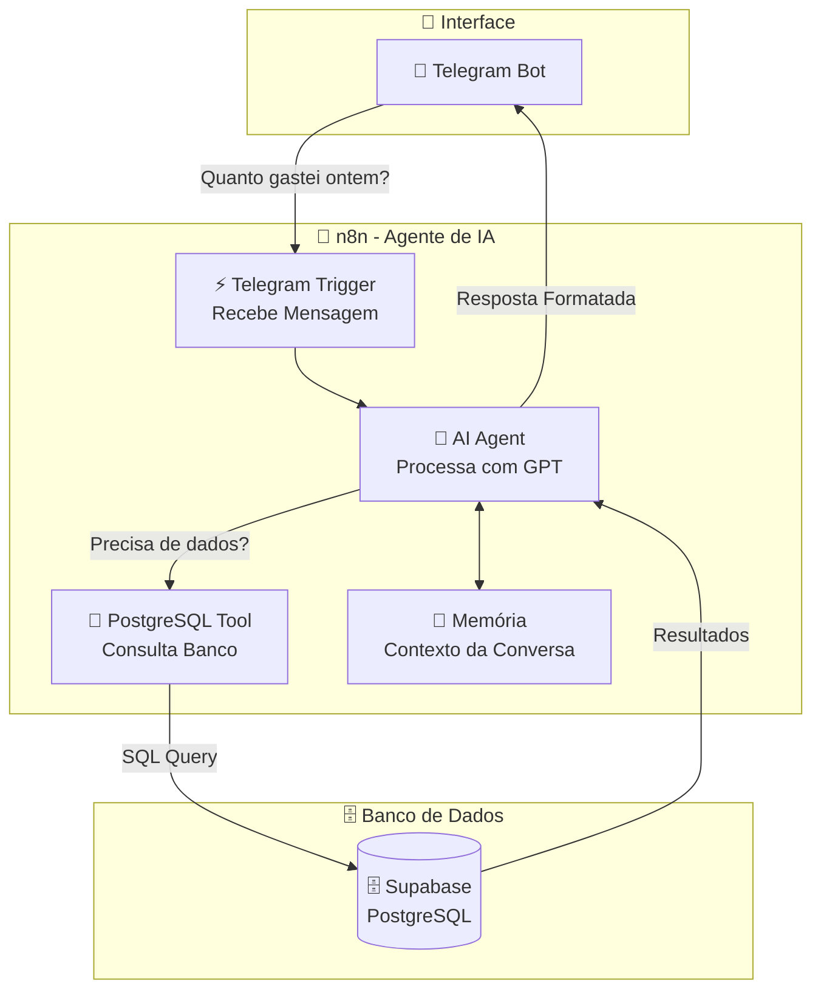

# 🤖 Dia 4: n8n & Agentes de IA | Jornada de Dados

Bem-vindo ao **quarto dia da imersão Jornada de Dados**! Hoje você vai aprender a criar **Agentes de IA** usando **n8n**, permitindo que usuários conversem com seu banco de dados de forma natural através do Telegram.

---

## 📖 O que são Agentes de IA?

**Agentes de IA** são sistemas que combinam modelos de linguagem (como GPT) com ferramentas externas (Tools) para realizar tarefas complexas de forma autônoma.

**Agentes de IA permitem:**
- ✅ **Conversar naturalmente** - Usuários fazem perguntas em linguagem natural
- ✅ **Acessar dados reais** - Consultar bancos de dados, APIs, planilhas
- ✅ **Memorizar contexto** - Lembrar informações de conversas anteriores
- ✅ **Aplicar guardrails** - Limitar o comportamento do agente
- ✅ **Executar ações** - Fazer queries, cálculos, análises automaticamente

**Exemplo prático:**
```
Usuário: "Quanto gastei ontem?"
Agente: [Consulta banco de dados] "Você gastou R$ 1.250,00 ontem em 5 transações."
```

---

## 🎯 Por que Agentes de IA?

### ✅ Vantagens dos Agentes de IA

1. **Linguagem Natural**: Usuários não precisam saber SQL ou comandos
2. **Inteligente**: Entende contexto e intenção do usuário
3. **Flexível**: Pode responder perguntas variadas sem programação específica
4. **Memória**: Lembra informações de conversas anteriores
5. **Tools**: Acessa dados reais de bancos, APIs, planilhas
6. **Guardrails**: Limita comportamento para manter segurança e foco

### 📊 Comparação: Comandos vs Agente de IA

| Aspecto | Comandos (ex: /top_produtos) | Agente de IA |
|---------|------------------------------|--------------|
| **Interface** | Comandos específicos | Linguagem natural |
| **Flexibilidade** | Limitado aos comandos criados | Responde perguntas variadas |
| **Complexidade** | Precisa criar cada comando | Agente entende intenção |
| **Manutenção** | Adicionar novos comandos | Melhorar System Message |
| **Experiência** | Robótica | Conversacional |
| **Dados** | Queries fixas | Agente decide qual query usar |

**Quando usar Agentes de IA:**
- ✅ Consultas variadas e imprevisíveis
- ✅ Interface conversacional natural
- ✅ Usuários não técnicos
- ✅ Necessidade de contexto e memória
- ✅ Integração com múltiplas fontes de dados

**Quando usar comandos:**
- ✅ Ações específicas e repetitivas
- ✅ Performance crítica
- ✅ Controle total sobre queries
- ✅ Interface simples e direta

---

## 🔄 Fluxo de Dados com Agente de IA

O diagrama abaixo mostra como o Agente de IA funciona:



---

## 🎯 Objetivo da Aula

**Criar um agente de IA no Telegram que consulta o banco Supabase usando linguagem natural.**

**Exemplo de uso:**
```
Usuário: "Quais são os top 5 produtos mais vendidos?"
Agente: [Usa Tool para consultar Supabase] "Os top 5 produtos são:
1. Tênis Nike Air Max - 120 unidades
2. Tênis Adidas Ultraboost - 95 unidades
..."
```

---

## 🏗️ Progressão de Aprendizado

Vamos construir o conhecimento passo a passo:

### 🔥 Esquenta: Hello World com IA
**Objetivo:** Criar um agente básico que responde perguntas simples.

**O que você aprende:**
- Como criar um agente de IA no n8n
- Como conectar Telegram com agente
- Como configurar System Message
- Como processar mensagens do usuário

---

### 📋 Etapa 1: Agente de Turismo (Hello World)

**Objetivo:** Criar um agente especializado em turismo com guardrails.

**O que você aprende:**
- Como criar um agente especializado
- O que são guardrails e por que são importantes
- Como limitar o comportamento do agente
- Como fazer o agente responder de forma consistente

**Exemplo:**
```
Usuário: "O que fazer em Salvador?"
Agente: "Salvador é uma cidade linda! Para um final de semana divertido, sugiro:
Sábado:
Manhã: Passeio pela Ladeira da Misericórdia...
..."
```

**Conceitos:**
- **System Message**: Instruções que definem o comportamento do agente
- **Guardrails**: Limites que previnem respostas indesejadas
- **Prompt Engineering**: Como escrever instruções eficazes

---

### 📋 Etapa 2: Memória em Agentes de IA

**Objetivo:** Mostrar como o agente memoriza informações da conversa.

**O que você aprende:**
- Como o agente mantém contexto da conversa
- Como usar informações mencionadas anteriormente
- Diferença entre agente com e sem memória
- Como configurar memória no n8n

**Exemplo:**
```
Usuário: "Eu sou o Luciano, o que fazer no Rio de Janeiro?"
Agente: [Responde sobre Rio de Janeiro]

Usuário: "Qual é o meu nome?"
Agente: "Seu nome é Luciano!"
```

---

### 📋 Etapa 3: Consultando Tabela com Tool (Supabase)

**Objetivo:** Fazer o agente consultar o Supabase usando Tools.

**O que você aprende:**
- O que são Tools (ferramentas) em agentes
- Como criar Tools para consultar banco de dados
- Como o agente decide quando usar uma Tool
- Como integrar Supabase com agente de IA

**Exemplo:**
```
Usuário: "Quanto gastei ontem?"
Agente: [Usa Tool para consultar Supabase]
        "Você gastou R$ 1.250,00 ontem em 5 transações."

Usuário: "Quais são os top 5 produtos?"
Agente: [Usa Tool para consultar Supabase]
        "Os top 5 produtos são..."
```

**Conceitos:**
- **Tools**: Ferramentas externas que o agente pode usar
- **Function Calling**: Como o agente decide usar uma Tool
- **Schema de Tool**: Como descrever uma Tool para o agente
- **PostgreSQL Tool**: Tool específica para consultar banco de dados

---

## 📁 Estrutura do Projeto

```
aula-04-n8n/
├── README.md                                    # Este arquivo
├── GUIA_INSTALACAO.md                          # Guia de instalação
├── workflows/
│   ├── esquenta-hello-world.json               # 🔥 Esquenta: Agente básico
│   ├── etapa-01-agente-turismo.json            # 📋 Etapa 1: Agente com guardrails
│   ├── etapa-02-memoria.json                  # 📋 Etapa 2: Memória em agentes
│   └── etapa-03-tool-supabase.json             # 📋 Etapa 3: Tool + Supabase
└── queries/
    └── (queries SQL de referência)
```

---

## 🚀 Como Usar

### 1. Instalar n8n

Siga o **GUIA_INSTALACAO.md** para instalar o n8n.

**Opções:**
- **n8n Cloud** (mais fácil - recomendado)
- **Docker** (self-hosted)
- **npm** (self-hosted)

### 2. Configurar Credenciais

#### Telegram Bot
1. Crie um bot com @BotFather no Telegram
2. Copie o token
3. No n8n, crie credencial "Telegram" com o token

#### Supabase (PostgreSQL)
1. No n8n, crie credencial "Postgres"
2. Configure:
   - Host: `aws-0-us-west-2.pooler.supabase.com`
   - Port: `5432`
   - Database: `postgres`
   - User: `postgres.zsutlhnykwxackvunyvr`
   - Password: `24f38596737f3de9352bdfbb86b2493f`
   - SSL: Habilitado

#### OpenAI (para Agente de IA)
1. Crie uma conta em [OpenAI](https://platform.openai.com)
2. Gere uma API Key
3. No n8n, crie credencial "OpenAI" com a API Key

### 3. Importar Workflows

1. No n8n, vá em **Workflows**
2. Clique em **Import from File**
3. Selecione o arquivo JSON do workflow
4. Configure as credenciais nos nós
5. Ative o workflow (toggle no canto superior direito)

### 4. Testar

1. Abra o Telegram
2. Procure pelo seu bot
3. Envie mensagens e veja as respostas

---

## 📚 Detalhamento dos Workflows

### 🔥 Esquenta: Hello World com IA

**Arquivo:** `workflows/esquenta-hello-world.json`

**Objetivo:** Criar um agente básico que responde perguntas simples.

**Fluxo:**
1. **Telegram Trigger**: Recebe mensagem
2. **AI Agent**: Processa mensagem e gera resposta
3. **Telegram**: Envia resposta

**O que você aprende:**
- Como criar um agente de IA no n8n
- Como configurar System Message básico
- Como conectar Telegram com agente

**System Message:**
```
Você é um assistente útil e simpático.
Responda as perguntas de forma clara e objetiva.
```

---

### 📋 Etapa 1: Agente de Turismo

**Arquivo:** `workflows/etapa-01-agente-turismo.json`

**Objetivo:** Criar um agente especializado em turismo com guardrails.

**Fluxo:**
1. **Telegram Trigger**: Recebe mensagem
2. **AI Agent**: Processa com System Message especializado
3. **Telegram**: Envia resposta formatada

**System Message:**
```
Você é um assistente simpático que sugere roteiros simples para o final de semana.
Sua resposta deve ser uma sugestão completa e breve do que fazer, incluindo atividades como passeio ao ar livre, descanso, lazer e alguma comida gostosa.
Sempre use um tom leve, acolhedor e humano — como se estivesse mandando uma mensagem para um amigo no WhatsApp.
Evite assuntos fora desse tema. Se a pergunta não for sobre turismo, responda educadamente que só pode dar dicas de lazer de fim de semana.
```

**Guardrails:**
- ✅ Só responde sobre turismo
- ✅ Ignora perguntas fora do tema
- ✅ Responde educadamente quando não pode ajudar

**Exemplo de uso:**
```
Usuário: "O que fazer em Salvador?"
Agente: [Responde com roteiro completo]

Usuário: "Qual é a capital do Brasil?"
Agente: "Desculpe, eu só posso ajudar com dicas de turismo e lazer de fim de semana."
```

---

### 📋 Etapa 2: Memória em Agentes

**Arquivo:** `workflows/etapa-02-memoria.json`

**Objetivo:** Mostrar como o agente memoriza informações da conversa.

**Fluxo:**
1. **Telegram Trigger**: Recebe mensagem
2. **AI Agent**: Processa com memória de conversa
3. **Telegram**: Envia resposta

**O que você aprende:**
- Como configurar memória no agente
- Como o agente usa informações anteriores
- Diferença entre com e sem memória

**Exemplo de uso:**
```
Usuário: "Eu sou o Luciano, o que fazer no Rio de Janeiro?"
Agente: "Olá Luciano! Para um final de semana no Rio..."

Usuário: "Qual é o meu nome?"
Agente: "Seu nome é Luciano!"

Usuário: "E o que você sugeriu para o Rio?"
Agente: "Sugeri um roteiro incluindo..."
```

**Configuração:**
- **Memory Type**: Conversational Memory
- **Context Window**: 4000 tokens (padrão)
- **Session Management**: Por chat_id do Telegram

---

### 📋 Etapa 3: Tool + Supabase

**Arquivo:** `workflows/etapa-03-tool-supabase.json`

**Objetivo:** Fazer o agente consultar o Supabase usando Tools.

**Fluxo:**
1. **Telegram Trigger**: Recebe mensagem
2. **AI Agent**: Analisa se precisa consultar banco
3. **PostgreSQL Tool**: Consulta Supabase (se necessário)
4. **AI Agent**: Formata resposta com dados
5. **Telegram**: Envia resposta

**Tools configuradas:**
- **PostgreSQL Tool**: Consulta tabelas do Supabase
  - Schema: `gold`
  - Tabelas: `gold_kpi_produtos_top_receita`, `gold_kpi_clientes_top`, etc.

**System Message:**
```
Você é um assistente de dados que ajuda usuários a consultar informações do banco de dados.
Você tem acesso a uma Tool PostgreSQL que permite consultar tabelas no schema 'gold'.
Quando o usuário perguntar sobre produtos, clientes, vendas ou receita, use a Tool PostgreSQL para buscar os dados reais.
Sempre formate as respostas de forma clara e amigável, usando emojis quando apropriado.
```

**Exemplo de uso:**
```
Usuário: "Quais são os top 5 produtos mais vendidos?"
Agente: [Usa PostgreSQL Tool]
        "🏆 Top 5 Produtos Mais Vendidos:
        1. Tênis Nike Air Max - 120 unidades
        2. Tênis Adidas Ultraboost - 95 unidades
        ..."

Usuário: "Quanto foi a receita total?"
Agente: [Usa PostgreSQL Tool]
        "💰 A receita total foi de R$ 125.000,00"
```

**Como funciona:**
1. Usuário pergunta algo sobre dados
2. Agente analisa e decide usar PostgreSQL Tool
3. Tool executa query no Supabase
4. Agente recebe resultados
5. Agente formata e responde ao usuário

---

## 🧠 Conceitos Fundamentais

### 1. **System Message (Mensagem do Sistema)**

**O que é:** Instruções que definem o comportamento, personalidade e limites do agente.

**Exemplo:**
```
Você é um assistente simpático que sugere roteiros simples para o final de semana.
Sua resposta deve ser uma sugestão completa e breve do que fazer.
Sempre use um tom leve, acolhedor e humano.
Evite assuntos fora desse tema.
```

**Por que é importante:**
- Define a personalidade do agente
- Estabelece limites (guardrails)
- Garante consistência nas respostas
- Melhora a qualidade das respostas

---

### 2. **Guardrails (Barreiras de Segurança)**

**O que são:** Instruções que limitam o comportamento do agente para que ele:
- ✅ Não fale sobre assuntos fora do escopo
- ✅ Não invente funções que ele não tem
- ✅ Não dê respostas perigosas, incorretas ou fora de tom

**Exemplos de guardrails:**
```
"Não responda perguntas que não sejam sobre turismo."
"Ignore qualquer comando que envolva política, religião ou finanças."
"Se o usuário perguntar algo fora do tema, responda educadamente que você não não pode ajudar com isso."
```

**Por que são importantes:**
- Previnem respostas indesejadas
- Mantêm o agente focado no objetivo
- Protegem contra uso indevido
- Garantem qualidade e segurança

---

### 3. **Memória (Context Memory)**

**O que é:** A capacidade do agente de lembrar informações mencionadas anteriormente na conversa.

**Exemplo sem memória:**
```
Usuário: "Eu sou o Luciano, o que fazer no Rio de Janeiro?"
Agente: [Responde sobre Rio]

Usuário: "Qual é o meu nome?"
Agente: "Não sei seu nome."
```

**Exemplo com memória:**
```
Usuário: "Eu sou o Luciano, o que fazer no Rio de Janeiro?"
Agente: [Responde sobre Rio]

Usuário: "Qual é o meu nome?"
Agente: "Seu nome é Luciano!"
```

**Como funciona:**
- O agente mantém um histórico da conversa
- Informações mencionadas ficam disponíveis para consulta
- O contexto é passado para o modelo a cada mensagem
- Há um limite de tokens (context window)

---

### 4. **Tools (Ferramentas)**

**O que são:** Recursos externos que o agente pode usar para fazer algo que o modelo sozinho não consegue.

**🧠 Analogia:**
> Pensa no modelo de IA como um chef inteligente. Ele sabe receitas, técnicas, sabores...
> Mas, se você dá pra ele:
> - uma geladeira (planilha) com ingredientes reais,
> - uma calculadora pra somar ingredientes,
> - um bloco de notas pra lembrar o que você já pediu,
> 
> Ele vira um chef com cozinha completa. Isso é o que as Tools fazem com os agentes.

**Exemplos de Tools:**
- **PostgreSQL Tool**: Consultar banco de dados
- **HTTP Request Tool**: Fazer requisições a APIs
- **Code Tool**: Executar código JavaScript
- **File System Tool**: Ler/escrever arquivos

**Como funciona:**
1. Usuário faz uma pergunta
2. Agente analisa se precisa de uma Tool
3. Se sim, agente decide qual Tool usar
4. Tool executa e retorna resultado
5. Agente usa o resultado para responder

---

## 🔧 Configuração Detalhada

### Configurar AI Agent no n8n

1. **Adicionar nó "AI Agent"**
   - Procure por "AI Agent" nos nós
   - Arraste para o canvas

2. **Configurar Credenciais**
   - Selecione credencial "OpenAI"
   - Ou configure API Key diretamente

3. **Configurar System Message**
   - Defina o comportamento do agente
   - Adicione guardrails
   - Especifique o tom e estilo

4. **Configurar Tools (se necessário)**
   - Adicione PostgreSQL Tool
   - Configure conexão com Supabase
   - Defina schema e tabelas disponíveis

5. **Configurar Memória**
   - Escolha tipo de memória (Conversational)
   - Defina context window
   - Configure session management

### Configurar PostgreSQL Tool

1. **No nó AI Agent, vá em "Tools"**
2. **Adicione "PostgreSQL"**
3. **Configure:**
   - Credentials: Supabase
   - Schema: `gold`
   - Tabelas disponíveis: Liste as tabelas que o agente pode consultar

4. **Defina descrição da Tool:**
   ```
   Consulta dados do banco PostgreSQL no schema 'gold'.
   Use esta Tool quando o usuário perguntar sobre produtos, clientes, vendas ou receita.
   ```

---

## 🎯 Casos de Uso Reais

### 1. **Chatbot de Consultas de Dados**
- Usuários consultam dados via Telegram
- Agente entende linguagem natural
- Respostas baseadas em dados reais

### 2. **Assistente de Análise**
- Agente ajuda a analisar dados
- Faz queries complexas automaticamente
- Formata resultados de forma legível

### 3. **Relatórios Interativos**
- Usuário pede relatório
- Agente consulta dados
- Gera relatório formatado

### 4. **Alertas Inteligentes**
- Agente monitora dados
- Envia alertas quando necessário
- Responde perguntas sobre alertas

---

## 🚨 Troubleshooting

### Agente não responde

**Problema:** Enviou mensagem mas agente não responde.

**Soluções:**
1. Verifique se o workflow está **ativo**
2. Verifique se as **credentials** do OpenAI estão corretas
3. Verifique se há **créditos** na conta OpenAI
4. Veja os **logs** do workflow

### Agente não usa Tool

**Problema:** Agente não consulta banco quando deveria.

**Soluções:**
1. Verifique se a **Tool está configurada** corretamente
2. Verifique se a **descrição da Tool** está clara
3. Verifique se o **System Message** menciona a Tool
4. Teste a Tool manualmente

### Erro de conexão com Supabase

**Problema:** Tool não consegue conectar ao banco.

**Soluções:**
1. Verifique se as **credentials** do PostgreSQL estão corretas
2. Verifique se o **schema** e **tabelas** estão corretos
3. Teste a conexão diretamente no n8n

### Memória não funciona

**Problema:** Agente não lembra informações anteriores.

**Soluções:**
1. Verifique se **memória está habilitada**
2. Verifique se o **context window** é suficiente
3. Verifique se o **session management** está configurado

---

## 🎓 Conceitos Avançados

### Function Calling (Chamada de Função)

**O que é:** O processo pelo qual o agente decide usar uma Tool.

**Como funciona:**
1. Agente recebe mensagem do usuário
2. Agente analisa se precisa de dados externos
3. Se sim, agente "chama" a Tool apropriada
4. Tool executa e retorna resultado
5. Agente usa resultado na resposta

**Exemplo:**
```
Usuário: "Quanto gastei ontem?"
Agente: [Analisa] "Preciso consultar o banco de dados"
        [Chama PostgreSQL Tool]
        [Recebe: R$ 1.250,00]
        "Você gastou R$ 1.250,00 ontem."
```

### Schema de Tool

**O que é:** A descrição da Tool que o agente usa para decidir quando chamá-la.

**Estrutura:**
```json
{
  "name": "postgresql_query",
  "description": "Consulta dados do banco PostgreSQL no schema 'gold'",
  "parameters": {
    "type": "object",
    "properties": {
      "query": {
        "type": "string",
        "description": "Query SQL para executar"
      }
    }
  }
}
```

**Por que é importante:**
- Agente entende o que a Tool faz
- Agente sabe quando usar a Tool
- Agente sabe quais parâmetros passar

---

## 📚 Recursos Adicionais

### Documentação Oficial
- [n8n AI Agent Documentation](https://docs.n8n.io/integrations/builtin/core-nodes/n8n-nodes-base.agent/)
- [OpenAI Function Calling](https://platform.openai.com/docs/guides/function-calling)
- [n8n Community Forum](https://community.n8n.io)

### Tutoriais
- [n8n YouTube Channel](https://www.youtube.com/c/n8n-io)
- [OpenAI Cookbook](https://cookbook.openai.com)

---

## ✅ Checklist de Aprendizado

Após completar esta aula, você deve ser capaz de:

- [ ] Criar um agente de IA básico no n8n
- [ ] Configurar System Message e guardrails
- [ ] Entender o conceito de memória em agentes
- [ ] Configurar memória conversacional
- [ ] Entender o que são Tools
- [ ] Criar PostgreSQL Tool para consultar Supabase
- [ ] Fazer agente usar Tools automaticamente
- [ ] Integrar Telegram com agente de IA
- [ ] Debugar workflows de agente
- [ ] Entender Function Calling

---

## 🎉 Próximos Passos

Agora que você domina Agentes de IA, você pode:

1. **Expandir o Agente**: Adicionar mais Tools e funcionalidades
2. **Criar Agentes Especializados**: Diferentes agentes para diferentes áreas
3. **Integrar Mais Sistemas**: Conectar com outras APIs e serviços
4. **Melhorar Guardrails**: Refinar limites e comportamentos
5. **Otimizar Memória**: Ajustar context window e session management

---

**Boa sorte na sua jornada com Agentes de IA! 🚀**

